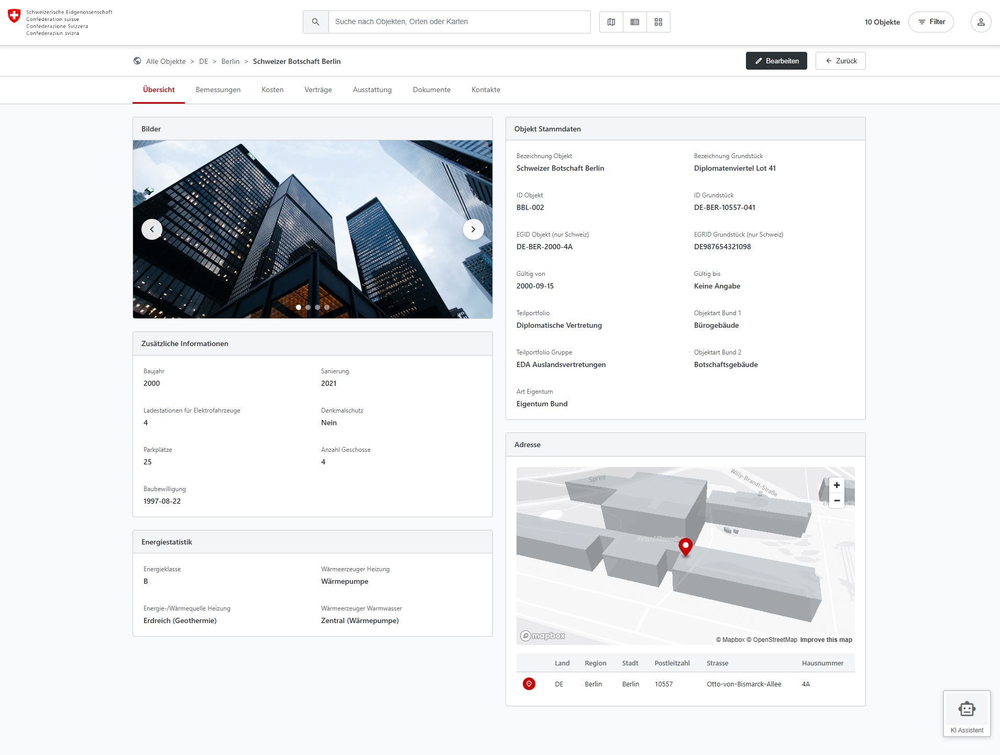
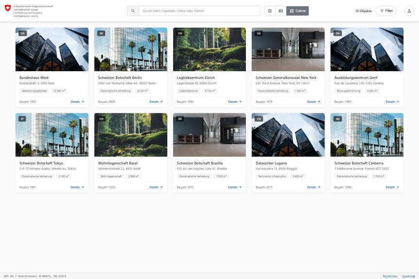
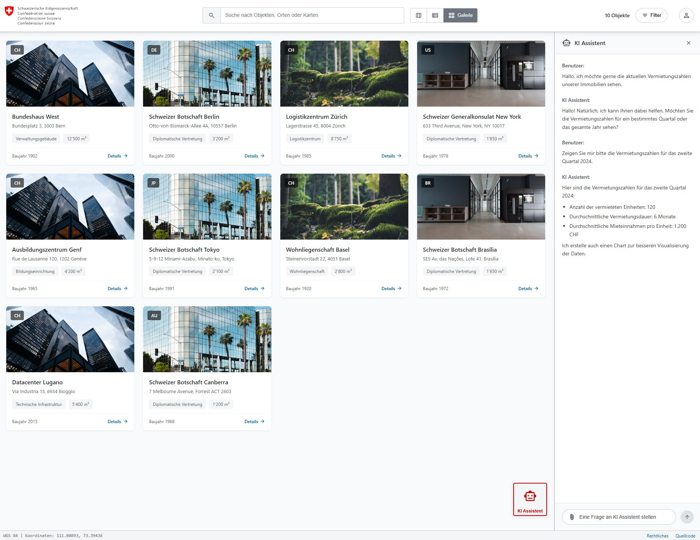

# BBL Immobilienportfolio - GIS POC

A single-page web application for geographic information systems (GIS) designed to visualize and manage the real estate portfolio of BBL (Bundesamt für Bauten und Logistik - Swiss Federal Office of Buildings and Logistics).

- Deployed: [davras5.github.io/gis-immo/](https://davras5.github.io/gis-immo/)

<p align="center">
  
</p>

<p align="center">
  
  &nbsp;&nbsp;&nbsp;
  
  &nbsp;&nbsp;&nbsp;
</p>

## Features

### Multiple View Modes
- **Map View** - Interactive Mapbox GL JS map with property markers, navigation controls, and multiple map styles (Light, Standard, Satellite)
- **List View** - Tabular display with sortable columns (ID, Name, Land, Ort, Adresse, Portfolio, Fläche, Status)
- **Gallery View** - Grid layout with property cards and portfolio category tags
- **Detail View** - Comprehensive property information with tabbed interface

### Detail View Tabs

| Tab | Status | Description |
|-----|--------|-------------|
| Übersicht | Active | Overview with images, master data, energy statistics, address |
| Bemessungen | Active | Area measurements table with sorting, filtering, multi-select |
| Belegung | Disabled | Occupancy data (planned) |
| Kosten | Disabled | Cost information (planned) |
| Verträge | Disabled | Contracts (planned) |
| Ausstattung | Disabled | Equipment (planned) |
| Dokumente | Active | Documents table with sorting, filtering, multi-select |

### Property Details (Übersicht Tab)
- **Bilder** - Image carousel with navigation
- **Zusätzliche Informationen** - Construction year, renovation, EV charging stations, heritage protection, parking spaces, floors, building permit
- **Energiestatistik** - Energy class (A-E), heat generator, heat source, hot water system
- **Objekt Stammdaten** - Object name, land parcel, IDs (EGID/EGRID), validity dates, portfolio categories, ownership type
- **Adresse** - Interactive mini-map with 3D view and detailed address table (Country, Region, City, Postal code, Street, House number)

### Measurements Tab (Bemessungen)
- Sortable and filterable table
- Multi-select with checkbox selection
- Columns: ID, Bemessungsart, Wert, Einheit, Herkunft, Genauigkeit, Standard, Gültig von, Gültig bis
- Action buttons: Edit, Delete, View, Add

### Documents Tab (Dokumente)
- Sortable and filterable table
- Multi-select with checkbox selection
- Columns: ID, Titel, Typ, Format, Datum, Grösse
- Action buttons: Edit, Delete, Download, Add

### Search Functionality
- Real-time search with debouncing
- Searches across property names and addresses
- Integration with Swisstopo API for Swiss location search
- Search result dropdown with section headers

## Technologies

- **Mapbox GL JS v3.4.0** - Interactive mapping with 3D capabilities
- **Vanilla JavaScript (ES6+)** - Core application logic
- **Modern CSS3** - Styling with flexbox, CSS Grid, and CSS variables
- **Material Design Icons** - Icon library
- **GeoJSON** - Geographic data format
- **Swisstopo API** - Swiss location search

## Project Structure

```
gis-immo/
├── index.html              # Main application (HTML, CSS, JavaScript)
├── README.md               # This file
├── CLAUDE.md               # Development documentation
├── assets/
│   └── images/             # Preview screenshots
└── data/
    └── buildings.geojson   # Property dataset (10 buildings)
```

## Getting Started

### Prerequisites

- Any modern web browser (Chrome, Firefox, Safari, Edge)
- A local web server (WebGL required for map)

### Running Locally

**Using Python:**
```bash
python -m http.server 8000
# Visit http://localhost:8000
```

**Using Node.js:**
```bash
npx http-server
# Or: npx serve
```

**Using PHP:**
```bash
php -S localhost:8000
```

### Deployment

No build process is required. The application can be deployed to any static hosting service:
- GitHub Pages
- Netlify
- Vercel
- Apache/Nginx
- Any static file server

## Data Structure

Properties are stored in `data/buildings.geojson` as a GeoJSON FeatureCollection with 10 buildings across 6 countries.

### Portfolio Coverage

| Country | Properties | Examples |
|---------|------------|----------|
| Switzerland (CH) | 5 | Bundeshaus West, Logistikzentrum Zürich, Datacenter Lugano |
| Germany (DE) | 1 | Schweizer Botschaft Berlin |
| United States (US) | 1 | Schweizer Generalkonsulat New York |
| Japan (JP) | 1 | Schweizer Botschaft Tokyo |
| Brazil (BR) | 1 | Schweizer Botschaft Brasília |
| Australia (AU) | 1 | Schweizer Botschaft Canberra |

### Portfolio Categories

- Verwaltungsgebäude (Administration buildings)
- Diplomatische Vertretung (Diplomatic representation)
- Logistikzentrum (Logistics center)
- Bildungseinrichtung (Educational institutions)
- Wohnliegenschaft (Residential property)
- Technische Infrastruktur (Technical infrastructure)

### Property Fields

| Field | Description |
|-------|-------------|
| `id` | Unique property identifier (e.g., BBL-001) |
| `name` | Property name |
| `adresse` | Full address |
| `ort` | City |
| `region` | Region/Canton |
| `land` | Country code (CH, DE, US, JP, BR, AU) |
| `teilportfolio` | Portfolio category |
| `teilportfolio_gruppe` | Portfolio group |
| `verantwortlich` | Responsible person |
| `flaeche_ngf` | Usable floor area (m²) |
| `baujahr` | Year built |
| `sanierung` | Last renovation |
| `status` | Operational status |
| `geschosse` | Number of floors |
| `parkplaetze` | Parking spaces |
| `ladestationen` | EV charging stations |
| `denkmalschutz` | Heritage protection status |
| `baubewilligung` | Building permit date |
| `energieklasse` | Energy class (A-E) |
| `waermeerzeuger` | Heat generator |
| `waermequelle` | Heat/energy source |
| `warmwasser` | Hot water system |
| `grundstueck_name` | Land parcel name |
| `grundstueck_id` | Land parcel ID |
| `egid` | Federal building identifier (CH only) |
| `egrid` | Federal land registry ID (CH only) |
| `objektart1` | Object type 1 |
| `objektart2` | Object type 2 |
| `eigentum` | Ownership type |
| `gueltig_von` | Valid from date |
| `gueltig_bis` | Valid until date |
| `bemessungen` | Array of area measurements |
| `dokumente` | Array of documents |

### Bemessungen (Measurements) Structure

```json
{
  "id": "BBL-001-M1",
  "areaType": "Bruttogeschossfläche",
  "value": 15000,
  "unit": "m²",
  "accuracy": "Gemessen",
  "standard": "SIA 416",
  "validFrom": "15.03.2019",
  "validUntil": null,
  "source": "CAD/BIM"
}
```

**Measurement Types:**
- Bruttogeschossfläche (Gross floor area)
- Nettogeschossfläche (Net floor area)
- Energiebezugsfläche (Energy reference area)
- Volumen (Volume)
- Arbeitsplätze (Workstations)
- Lagerfläche, Wohnfläche, Serverraumfläche, etc.

**Standards:** SIA 416, SIA 380/1, DIN 277, BOMA, JIS A, ABNT NBR, AS/NZS

### Dokumente (Documents) Structure

```json
{
  "id": "BBL-001-D1",
  "titel": "Grundriss Erdgeschoss",
  "dokumentTyp": "Grundriss",
  "dateiformat": "PDF",
  "datum": "15.03.2019",
  "dateigroesse": "2.4 MB",
  "url": "#"
}
```

**Document Types:** Grundriss, Bauplan, Energieausweis, Baubewilligung, Brandschutzkonzept, Betriebsanleitung, Foto, Mietvertrag, Wartungsprotokoll

## Status Types

| Status | Color | Description |
|--------|-------|-------------|
| In Betrieb | Green | Operational |
| In Renovation | Orange | Under renovation |
| In Planung | Blue | In planning |
| Ausser Betrieb | Grey | Out of service |

## Configuration

The Mapbox access token is configured in `index.html`. To use your own token:

1. Create a free account at [Mapbox](https://www.mapbox.com/)
2. Generate an access token
3. Replace the existing token in the JavaScript section of `index.html`

## Swiss Standards

- **SIA 416** - Swiss standard for building areas
- **SIA 380/1** - Swiss standard for energy reference areas
- **EGID** - Federal building identifier (Eidgenössischer Gebäudeidentifikator)
- **EGRID** - Federal land registry identifier (Eidgenössischer Grundstücksidentifikator)
- **Swisstopo** - Swiss geodata API

## Browser Support

- Chrome (recommended)
- Firefox
- Safari
- Edge

## License

Licensed under [CC BY 4.0](https://creativecommons.org/licenses/by/4.0/)

---

*This is an unofficial mockup for demonstration purposes.*
