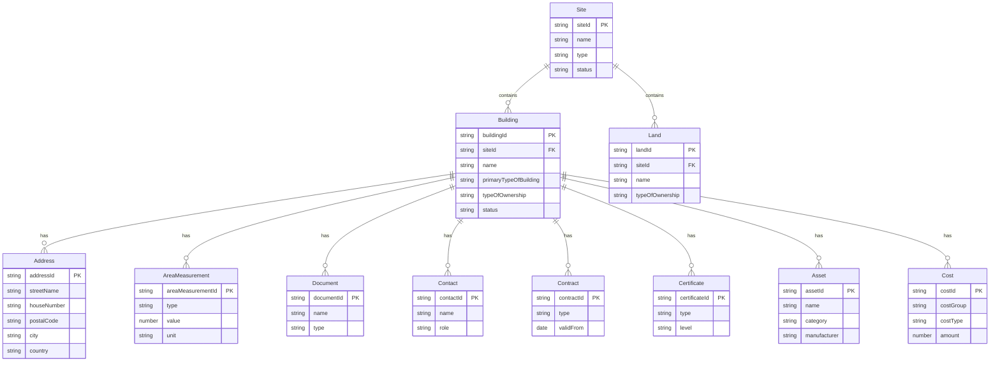

# BBL GIS Immobilienportfolio - Data Model

This document describes the data model for the BBL Immobilienportfolio application. While the current demo implementation uses a single GeoJSON file (`data/buildings.geojson`), the underlying data model consists of multiple related entities.

---

## Table of Contents

- [Overview](#overview)
- [Demo Stage Implementation](#demo-stage-implementation)
- [Entity: Site](#entity-site)
- [Entity: Address (Adresse)](#entity-address-adresse)
- [Entity: Land (Grundstück)](#entity-land-grundstück)
- [Entity: Building (Gebäude)](#entity-building-gebäude)
- [Entity: Area Measurement (Bemessung)](#entity-area-measurement-bemessung)
- [Entity: Document (Dokument)](#entity-document-dokument)
- [Entity: Contact (Kontakt)](#entity-contact-kontakt)
- [Entity: Asset (Ausstattung)](#entity-asset-ausstattung)
- [Entity: Contract (Vertrag)](#entity-contract-vertrag)
- [Entity: Cost (Kosten)](#entity-cost-kosten)
- [Enumerations](#enumerations)
  - [Building Types](#building-types)
  - [Energy Types](#energy-types)
  - [Heating Types](#heating-types)
- [Related Entities (Preview)](#related-entities-preview)
- [Version History](#version-history)
- [References](#references)

---

## Overview



## Demo Stage Implementation

For the demo stage, all entities are stored in a single GeoJSON file:

```
data/buildings.geojson
```

Related entities (Bemessungen, Dokumente, Kontakte, Verträge) are embedded as arrays within each building's properties. In a production system, these would be separate entities with foreign key relationships.

---

## Entity: Site

A site represents a logical grouping of buildings, such as a campus, property, or land parcel. Buildings belong to exactly one site.

### Schema Definition

| Field | Type | Description | Constraints | Comment |
|-------|------|-------------|-------------|---------|
| **siteId** | string | Unique identifier; must either originate from the previous system or be explicitly defined. | **mandatory**, minLength: 1, maxLength: 50 | Not used in current demo |
| **name** | string | Name of the site. | **mandatory**, minLength: 1, maxLength: 50 | Not used in current demo |
| **type** | string, enum | Type of site. Options: `Education`, `Health Care`, `Hotel`, `Industrial`, `Lodging`, `Leisure & Recreation`, `Mixed Use`, `Office`, `Residential`, `Retail`, `Technology/Science`, `Other` | **mandatory** | Derived from `teilportfolio` or `objektart1` |
| **addressIds** | array[string] | Array of address IDs linked to this site. | **mandatory**, minLength: 1, maxLength: 50 per ID | Collect from linked buildings |
| **validFrom** | string | The record can be used from this date onwards. ISO 8601 format: `yyyy-mm-ddThh:mm:ssZ` | **mandatory**, minLength: 20 | Source: `gueltig_von`, convert to ISO 8601 |
| **validUntil** | string | The record is valid until this date. ISO 8601 format: `yyyy-mm-ddThh:mm:ssZ` | **mandatory**, minLength: 20, null allowed | Source: `gueltig_bis`, convert to ISO 8601 |
| energyRatingIds | array[string] | Array of energy rating IDs. | minLength: 1, maxLength: 50 per ID | |
| eventType | string, enum | Type of the event as domain event. Options: `SiteAdded`, `SiteUpdated`, `SiteDeleted` | | |
| extensionData | object | Extension data for storing any custom data. | JSON object | Container for Swiss-specific fields |
| siteCode | string | User specific site code. | minLength: 1, maxLength: 70 | |
| status | string | Status of site. | minLength: 1, maxLength: 50 | |
| extensionData.egrid | string | Eidgenössischer Grundstücksidentifikator (Federal Property Identifier) | | Swiss extension. Source: `egrid` |
| extensionData.parzellenNummer | string | Official parcel number | | Swiss extension |
| extensionData.grundbuchKreis | string | Land registry district | | Swiss extension |
| extensionData.katasterNummer | string | Cadastral number | | Swiss extension |
| extensionData.teilportfolioGruppe | string | Sub-portfolio group (e.g., "Bundesverwaltung") | | Swiss extension. Source: `teilportfolio_gruppe` |

### Example: Site Object

```json
{
  "siteId": "BE-3003-1001",
  "name": "Bundesplatz Parzelle A",
  "type": "Office",
  "addressIds": ["BBL-001-ADDR-1"],
  "validFrom": "1900-01-01T00:00:00Z",
  "validUntil": null,
  "siteCode": "BPL-A",
  "status": "Aktiv",
  "extensionData": {
    "egrid": "CH123456789012",
    "teilportfolioGruppe": "Bundesverwaltung",
    "grundbuchKreis": "Bern",
    "parzellenNummer": "1001"
  }
}
```

---

## Entity: Address (Adresse)

Addresses represent the physical location of a building. A building can have multiple addresses (e.g., corner buildings with entrances on different streets).

### Schema Definition

| Field | Type | Description | Constraints | Comment |
|-------|------|-------------|-------------|---------|
| **addressId** | string | Unique identifier; must either originate from the previous system or be explicitly defined. | **mandatory**, minLength: 1, maxLength: 50 | Generated: buildingId + "-ADDR-1" |
| **city** | string | Any official settlement including cities, towns, villages, hamlets, localities, etc. | **mandatory**, minLength: 1, maxLength: 100 | Source: `ort` |
| **country** | string, enum | Sovereign nations with ISO-3166 code. Common: `CH`, `DE`, `FR`, `IT`, `AT`, `BE`, `US` | **mandatory** | Source: `land` (already ISO-3166) |
| **type** | string, enum | Type of address. Options: `Primary`, `Other` | **mandatory** | Default: "Primary" for main address |
| **geoCoordinates.geoCoordinateId** | string | Unique identifier for the coordinate set. | **mandatory**, minLength: 1, maxLength: 50 | Generated: buildingId + "-GEO-1" |
| geoCoordinates.coordinateReferenceSystem | string | Specific coordinate reference system used (e.g., "WGS84", "LV95"). | minLength: 1, maxLength: 50 | Default: "WGS84" for GeoJSON |
| geoCoordinates.latitude | number | Latitude coordinate (WGS84: -90 to 90). | | Source: `geometry.coordinates[1]` |
| geoCoordinates.longitude | number | Longitude coordinate (WGS84: -180 to 180). | | Source: `geometry.coordinates[0]` |
| additionalInformation | string | Additional information (building name, door number, etc.). | minLength: 1, maxLength: 500 | |
| apartmentOrUnit | string | Unit or apartment number. | minLength: 1, maxLength: 50 | |
| district | string | Borough or district within a city. | minLength: 1, maxLength: 50 | |
| eventType | string, enum | Type of the event as domain event. Options: `AddressAdded`, `AddressUpdated` | | |
| extensionData | object | Extension data for storing any custom data. | JSON object | Container for country-specific fields |
| houseNumber | string | House number of the street. | minLength: 1, maxLength: 50 | Source: `hausnummer` |
| postalCode | string | Postal code for mail sorting. | minLength: 1, maxLength: 15 | Source: `plz` |
| stateProvincePrefecture | string | First-level administrative division (state, province, canton). | minLength: 1, maxLength: 50 | Source: `region` |
| streetName | string | Name of the street. | minLength: 1, maxLength: 150 | Extracted from `adresse` |
| extensionData.formattedAddress | string | Pre-formatted full address string | | Source: `adresse` |

### Example: Address Object

```json
{
  "addressId": "BBL-001-ADDR-1",
  "type": "Primary",
  "streetName": "Bundesplatz",
  "houseNumber": "3",
  "postalCode": "3003",
  "city": "Bern",
  "stateProvincePrefecture": "Kanton Bern",
  "country": "CH",
  "geoCoordinates": {
    "geoCoordinateId": "BBL-001-GEO-1",
    "coordinateReferenceSystem": "WGS84",
    "latitude": 46.9466,
    "longitude": 7.4448
  },
  "extensionData": {
    "formattedAddress": "Bundesplatz 3, 3003 Bern"
  }
}
```

---

## Entity: Land (Grundstück)

Land represents a parcel of land or plot that belongs to a site. In the current demo, land information is partially embedded in building properties (`grundstueck_id`, `grundstueck_name`). In a production system, Land would be a separate entity allowing multiple land parcels per site.

### Schema Definition

| Field | Type | Description | Constraints | Comment |
|-------|------|-------------|-------------|---------|
| **landId** | string | Unique identifier; must either originate from the previous system or be explicitly defined. | **mandatory**, minLength: 1, maxLength: 50 | Source: `grundstueck_id` or generated |
| **name** | string | Name of land (e.g., park, garden, parking). | **mandatory**, minLength: 1, maxLength: 200 | Source: `grundstueck_name` |
| **siteId** | string | Refers to the site which the land belongs to. | **mandatory**, minLength: 1, maxLength: 50 | Not used in current demo (Site entity not implemented) |
| **typeOfOwnership** | string, enum | Is the land owned or leased? Options: `Owner`, `Tenant` | **mandatory** | Source: `eigentum`. "Eigentum Bund" → Owner |
| **validFrom** | string | The record can be used from this date onwards. ISO 8601 format: `yyyy-mm-ddThh:mm:ssZ` | **mandatory**, minLength: 20 | Source: `gueltig_von`, convert to ISO 8601 |
| **validUntil** | string | The record is valid until this date. ISO 8601 format: `yyyy-mm-ddThh:mm:ssZ` | **mandatory**, minLength: 20, null allowed | Source: `gueltig_bis`, convert to ISO 8601 |
| addressIds | array[string] | Array of address IDs linked to this land. | minLength: 1, maxLength: 50 per ID | |
| eventType | string, enum | Type of the event as domain event. Options: `LandAdded`, `LandUpdated`, `LandDeleted` | | |
| extensionData | object | Extension data for storing any custom data. | JSON object | Container for country-specific fields |
| landCode | string | User specific land code. | minLength: 1, maxLength: 70 | |
| landCoverage | string | Development level of land. | minLength: 1, maxLength: 50 | |
| landParcelNr | string | District/zoning number registered for the plot of land. | minLength: 1, maxLength: 50 | |
| selfUse | boolean | Is the land self-used? | | |
| status | string | Status of land. | minLength: 1, maxLength: 50 | |
| tenantStructure | string, enum | Tenant structure. Options: `Single-tenant`, `Multi-tenant` | | |
| valuationIds | array[string] | Array of valuation IDs. | minLength: 1, maxLength: 50 per ID | |
| extensionData.egrid | string | Federal property identifier (country-specific) | | Source: `egrid` |

### Example: Land Object

```json
{
  "landId": "BE-3003-1001",
  "name": "Bundesplatz Parzelle A",
  "typeOfOwnership": "Owner",
  "validFrom": "1900-01-01T00:00:00Z",
  "validUntil": null,
  "addressIds": ["BBL-001-ADDR-1"],
  "status": "Aktiv",
  "extensionData": {
    "egrid": "CH123456789012"
  }
}
```

---

## Entity: Building (Gebäude)

The building is the core entity representing a physical structure in the portfolio.

### Schema Definition

| Field | Type | Description | Constraints | Comment |
|-------|------|-------------|-------------|---------|
| **buildingId** | string | Unique identifier; must either originate from the previous system or be explicitly defined. | **mandatory**, minLength: 1, maxLength: 50 | Source: `id` |
| **name** | string | User specific building name (e.g., "Bundeshaus West", "EMEA Headquarter"). | **mandatory**, minLength: 1, maxLength: 200 | Source: `name` |
| **siteId** | string | Refers to the site which the building belongs to. | **mandatory**, minLength: 1, maxLength: 50 | Not used in current demo (Site entity not implemented) |
| **primaryTypeOfBuilding** | string, enum | Primary type of building use. See [Building Types](#building-types). | **mandatory** | Source: `objektart1`, needs value mapping |
| **typeOfOwnership** | string, enum | Is the building owned or leased? Options: `Owner`, `Tenant` | **mandatory** | Source: `eigentum`. "Eigentum Bund" → Owner, "Miete" → Tenant |
| **validFrom** | string | The record can be used from this date onwards. ISO 8601 format: `yyyy-mm-ddThh:mm:ssZ` | **mandatory**, minLength: 20 | Source: `gueltig_von`, convert to ISO 8601 |
| **validUntil** | string | The record is valid until this date. ISO 8601 format: `yyyy-mm-ddThh:mm:ssZ` | **mandatory**, minLength: 20, null allowed | Source: `gueltig_bis`, convert to ISO 8601 |
| addressIds | array[string] | Array of address IDs linked to this building. | minLength: 1, maxLength: 50 per ID | |
| airConditioning | boolean | Does the building have air conditioning? | | |
| buildingCode | string | User specific building code. | minLength: 1, maxLength: 70 | |
| buildingPermitDate | string | Building permit date. ISO 8601 format. | minLength: 20 | Source: `baubewilligung`, convert to ISO 8601 |
| certificateIds | array[string] | Array of certificate IDs. | minLength: 1, maxLength: 50 per ID | |
| constructionYear | string | Year of construction. ISO 8601 format. Use `yyyy-01-01T00:00:00Z` if only year is known. | minLength: 20 | Source: `baujahr`, convert year to ISO 8601 |
| electricVehicleChargingStations | number | Number of EV charging stations. | maximum: 9999 | Source: `ladestationen` |
| energyEfficiencyClass | string | Energy Efficiency Class of Building (e.g., "A", "B", "C"). | minLength: 1, maxLength: 50 | Source: `energieklasse` |
| energyRatingIds | array[string] | Array of energy rating IDs. | minLength: 1, maxLength: 50 per ID | |
| eventType | string, enum | Type of the event as domain event. Options: `BuildingAdded`, `BuildingUpdated`, `BuildingDeleted` | | |
| expectedLifeEndDate | string | Expected end date of building lifecycle. ISO 8601 format. | minLength: 20 | |
| extensionData | object | Extension data for storing any custom data. | JSON object | Container for Swiss-specific fields |
| fossilFuelExposure | string, enum | Fossil fuel exposure type. Options: `Extraction`, `Storage`, `Transport`, `Manufacture`, `Other`, `Not exposed` | | |
| monumentProtection | boolean | Is the building declared as a protected monument? | | Source: `denkmalschutz`. "Ja" → true, "Nein" → false |
| netZeroEnergyBuilding | boolean | Is the building a net zero energy building? | | |
| numberOfEmployees | number | Number of employees. | maximum: 999999 | |
| numberOfFloors | number | Number of floors/stories in the building. | | Source: `geschosse` |
| parkingSpaces | number | Number of parking spaces. | maximum: 9999 | Source: `parkplaetze` |
| percentageOfOwnership | number | Percentage of ownership. | maximum: 100 | |
| primaryEnergyType | string, enum | Primary type of energy used. See [Energy Types](#energy-types). | | |
| primaryWaterType | string | Type of water used. | minLength: 1, maxLength: 50 | |
| secondaryHeatingType | string, enum | Secondary type of heating. See [Heating Types](#heating-types). | | |
| secondaryTypeOfBuilding | string, enum | Secondary type of building use. See [Building Types](#building-types). | | Source: `objektart2`, needs value mapping |
| selfUse | boolean | Is the building self-used? | | |
| status | string | Status of building (e.g., "In Betrieb", "In Renovation"). | minLength: 1, maxLength: 50 | Source: `status` |
| tenantStructure | string, enum | Tenant structure. Options: `Single-tenant`, `Multi-tenant` | | |
| valuationIds | array[string] | Array of valuation IDs. | minLength: 1, maxLength: 50 per ID | |
| yearOfLastRefurbishment | string | Year of last refurbishment. ISO 8601 format. | minLength: 20 | Source: `sanierung`, convert to ISO 8601 |
| extensionData.responsiblePerson | string | Name of responsible person for the building | | Source: `verantwortlich` |
| extensionData.egid | string | Federal building identifier (country-specific) | | Source: `egid` |
| extensionData.egrid | string | Federal property identifier (country-specific) | | Source: `egrid` |
| extensionData.portfolio | string | Sub-portfolio category | | Source: `teilportfolio` |
| extensionData.portfolioGroup | string | Portfolio group | | Source: `teilportfolio_gruppe` |
| extensionData.heatingGenerator | string | Heating generator type | | Source: `waermeerzeuger` |
| extensionData.heatingSource | string | Heating source | | Source: `waermequelle` |
| extensionData.hotWater | string | Hot water system description | | Source: `warmwasser` |

### Example: Building Object

```json
{
  "buildingId": "BBL-001",
  "name": "Bundeshaus West",
  "primaryTypeOfBuilding": "Office Corporate",
  "secondaryTypeOfBuilding": "Mixed Use Office/Retail",
  "typeOfOwnership": "Owner",
  "validFrom": "1902-06-01T00:00:00Z",
  "validUntil": null,
  "addressIds": ["ADDR-001"],
  "constructionYear": "1902-01-01T00:00:00Z",
  "buildingPermitDate": "1898-03-15T00:00:00Z",
  "yearOfLastRefurbishment": "2019-01-01T00:00:00Z",
  "numberOfFloors": 5,
  "parkingSpaces": 45,
  "electricVehicleChargingStations": 8,
  "monumentProtection": true,
  "status": "In Betrieb",
  "energyEfficiencyClass": "C",
  "extensionData": {
    "egid": "301001234",
    "portfolio": "Verwaltungsgebäude",
    "portfolioGroup": "Bundesverwaltung",
    "heatingGenerator": "Fernwärme",
    "heatingSource": "Fernwärmenetz Stadt Bern",
    "hotWater": "Zentral (Fernwärme)"
  }
}
```

---

## Entity: Area Measurement (Bemessung)

Area measurements capture floor areas, volumes, and other quantitative measurements for buildings, floors, spaces, or sites. In the current demo, measurements are embedded in the `bemessungen` array within each building.

### Schema Definition

| Field | Type | Description | Constraints | Comment |
|-------|------|-------------|-------------|---------|
| **areaMeasurementId** | string | Unique identifier; must either originate from the previous system or be explicitly defined. | **mandatory**, minLength: 1, maxLength: 50 | Source: `bemessungen[].id` |
| **type** | string, enum | Type of the standard area. See [Area Types](#area-types). | **mandatory** | Source: `bemessungen[].areaType`, needs value mapping |
| **value** | number | Value of measurement. | **mandatory** | Source: `bemessungen[].value` |
| **unit** | string, enum | Unit area is measured with. Options: `sqm`, `sqft`, `acr` | **mandatory** | Source: `bemessungen[].unit`. "m²" → sqm |
| **validFrom** | string | The record can be used from this date onwards. ISO 8601 format: `yyyy-mm-ddThh:mm:ssZ` | **mandatory**, minLength: 20 | Source: `bemessungen[].validFrom`, convert to ISO 8601 |
| **validUntil** | string | The record is valid until this date. ISO 8601 format: `yyyy-mm-ddThh:mm:ssZ` | **mandatory**, minLength: 20, null allowed | Source: `bemessungen[].validUntil`, convert to ISO 8601 |
| **bmEstimation** | boolean | Is the data estimated by BuildingMinds? | **mandatory** | Default: false for imported data |
| accuracy | string, enum | Accuracy of area measurement. Options: `Estimated`, `Measured`, `Aggregated`, `Unknown` | | Source: `bemessungen[].accuracy`. "Gemessen" → Measured, "Geschätzt" → Estimated, "Berechnet" → Estimated, "Aggregiert" → Aggregated |
| buildingIds | array[string] | Array of building IDs this measurement belongs to. | minLength: 1, maxLength: 50 per ID | Derived from parent building |
| eventType | string, enum | Type of the event as domain event. Options: `AreaMeasurementAdded`, `AreaMeasurementUpdated`, `AreaMeasurementDeleted` | | |
| extensionData | object | Extension data for storing any custom data. | JSON object | Container for Swiss-specific fields |
| floorIds | array[string] | Array of floor IDs. | minLength: 1, maxLength: 50 per ID | |
| landIds | array[string] | Array of land IDs. | minLength: 1, maxLength: 50 per ID | |
| rentalUnit | array[string] | Array of rental unit IDs. | minLength: 1, maxLength: 50 per ID | |
| siteIds | array[string] | Array of site IDs. | minLength: 1, maxLength: 50 per ID | |
| spaceIds | array[string] | Array of space IDs. | minLength: 1, maxLength: 50 per ID | |
| standard | string, enum | Area measurement standard. Options: `DIN 277-1`, `MFG`, `IPMS`, `RICS`, `BOMA`, `NA` | | Source: `bemessungen[].standard`. "SIA 416" → extensionData, "DIN 277" → DIN 277-1 |
| extensionData.siaStandard | string | Swiss SIA standard reference (e.g., "SIA 416", "SIA 380/1") | | Swiss extension. Source: `bemessungen[].standard` |
| extensionData.source | string | Data source (e.g., "CAD/BIM", "Vermessung", "Schätzmodell", "Manuell") | | Swiss extension. Source: `bemessungen[].source` |
| extensionData.originalUnit | string | Original unit before conversion (e.g., "m²", "m³", "Stk") | | Swiss extension. Source: `bemessungen[].unit` |
| extensionData.originalType | string | Original German area type name | | Swiss extension. Source: `bemessungen[].areaType` |

### Area Types

Options for the `type` field, grouped by standard:

| Category | Values |
|----------|--------|
| DIN 277 / General | `Gross floor area`, `Construction area`, `Net room area`, `Circulation area`, `Net usable area`, `Technical area` |
| Usage-specific | `Living/residence area`, `Office area`, `Production/laboratory area`, `Storage/distribution/selling area`, `Education/teaching/culture area`, `Healing/care area`, `Other uses` |
| IPMS | `Gross external area`, `External Wall area`, `Gross internal area`, `A-Vertical penetrations`, `B-Structural elements`, `C-Technical services`, `D-Hygiene areas`, `E-Circulation areas`, `F-Amenities`, `G-Workspace`, `H-Other areas` |
| BOMA / Rental | `Rentable area`, `Rentable exclusion`, `Boundary area`, `Rentable area common occupancy`, `Rentable area exclusive occupancy`, `Building amenity area`, `Building service area`, `Floor service area`, `Tenant ancillary area`, `Tenant area`, `Landlord area` |
| Site / Land | `Land area`, `Total surface area`, `Vegetated area`, `Non-vegetated area`, `Green ground area`, `Green roof area`, `Green wall area`, `Green terrace area` |
| Other | `Major vertical penetrations`, `Occupant Storage area`, `Parking area`, `Unenclosed Building Feature: Covered Gallery`, `Vacant area`, `Energy reference area`, `NA` |

### Type Mapping: Current GeoJSON → Target

| Current `areaType` (German) | Target `type` | Comment |
|-----------------------------|---------------|---------|
| Bruttogeschossfläche | `Gross floor area` | SIA 416: BGF |
| Nettogeschossfläche | `Net room area` | SIA 416: NGF |
| Energiebezugsfläche | `Energy reference area` | SIA 380/1: EBF |
| Nutzfläche | `Net usable area` | SIA 416: NF |
| Verkehrsfläche | `Circulation area` | SIA 416: VF |
| Funktionsfläche | `Technical area` | SIA 416: FF |
| Konstruktionsfläche | `Construction area` | SIA 416: KF |
| Volumen | `NA` | Store as extensionData (not an area) |
| Arbeitsplätze | `NA` | Store as extensionData (count, not area) |
| Reinigungsfläche | `NA` | Store as extensionData (Swiss-specific) |

### Example: Area Measurement Object

```json
{
  "areaMeasurementId": "BBL-001-M1",
  "type": "Gross floor area",
  "value": 15000,
  "unit": "sqm",
  "validFrom": "2019-03-15T00:00:00Z",
  "validUntil": null,
  "bmEstimation": false,
  "accuracy": "Measured",
  "standard": "NA",
  "buildingIds": ["BBL-001"],
  "extensionData": {
    "siaStandard": "SIA 416",
    "source": "CAD/BIM",
    "originalUnit": "m²",
    "originalType": "Bruttogeschossfläche"
  }
}
```

### Example: Volume Measurement (Swiss Extension)

For measurements that don't fit the standard area types (volumes, counts):

```json
{
  "areaMeasurementId": "BBL-001-M4",
  "type": "NA",
  "value": 52500,
  "unit": "sqm",
  "validFrom": "2019-03-15T00:00:00Z",
  "validUntil": null,
  "bmEstimation": false,
  "accuracy": "Measured",
  "standard": "NA",
  "buildingIds": ["BBL-001"],
  "extensionData": {
    "siaStandard": "SIA 416",
    "source": "CAD/BIM",
    "originalUnit": "m³",
    "originalType": "Volumen",
    "measurementCategory": "volume"
  }
}
```

---

## Entity: Document (Dokument)

Documents represent files and records associated with a building, such as floor plans, certificates, permits, and technical documentation.

### Schema Definition

| Field | Type | Description | Constraints | Comment |
|-------|------|-------------|-------------|---------|
| **documentId** | string | Unique identifier for the document. | **mandatory**, minLength: 1, maxLength: 50 | Source: `dokumente[].id` |
| **name** | string | Title or name of the document. | **mandatory**, minLength: 1, maxLength: 200 | Source: `dokumente[].titel` |
| **type** | string, enum | Type of document. See [Document Types](#document-types). | **mandatory** | Source: `dokumente[].dokumentTyp` |
| **buildingIds** | array[string] | Array of building IDs this document belongs to. | **mandatory**, minLength: 1 | Derived from parent building |
| **validFrom** | string | Document date or effective date. ISO 8601 format. | **mandatory**, minLength: 20 | Source: `dokumente[].datum`, convert to ISO 8601 |
| eventType | string, enum | Type of the event as domain event. Options: `DocumentAdded`, `DocumentUpdated`, `DocumentDeleted` | | |
| extensionData | object | Extension data for storing any custom data. | JSON object | Container for Swiss-specific fields |
| fileFormat | string | File format (e.g., "PDF", "DWG", "IFC"). | minLength: 1, maxLength: 20 | Source: `dokumente[].dateiformat` |
| fileSize | string | File size as string (e.g., "2.4 MB"). | minLength: 1, maxLength: 20 | Source: `dokumente[].dateigroesse` |
| url | string | URL or path to the document file. | minLength: 1, maxLength: 500 | Source: `dokumente[].url` |
| description | string | Description or notes about the document. | minLength: 1, maxLength: 1000 | |
| version | string | Document version identifier. | minLength: 1, maxLength: 20 | |
| validUntil | string | Expiry date for time-limited documents. ISO 8601 format. | minLength: 20, null allowed | |

### Document Types

Common document types for buildings:

| Type | Description |
|------|-------------|
| `Grundriss` | Floor plan |
| `Bauplan` | Construction/building plan |
| `Energieausweis` | Energy certificate (GEAK, etc.) |
| `Baubewilligung` | Building permit |
| `Brandschutzkonzept` | Fire protection concept |
| `Mietvertrag` | Lease agreement |
| `Wartungsprotokoll` | Maintenance protocol |
| `Foto` | Photograph |
| `Sonstige` | Other |

### Example: Document Object

```json
{
  "documentId": "BBL-001-D1",
  "name": "Grundriss Erdgeschoss",
  "type": "Grundriss",
  "buildingIds": ["BBL-001"],
  "validFrom": "2019-03-15T00:00:00Z",
  "fileFormat": "PDF",
  "fileSize": "2.4 MB",
  "url": "/documents/BBL-001/grundriss-eg.pdf"
}
```

---

## Entity: Contact (Kontakt)

Contacts represent persons associated with a building, such as property managers, caretakers, or portfolio managers.

### Schema Definition

| Field | Type | Description | Constraints | Comment |
|-------|------|-------------|-------------|---------|
| **contactId** | string | Unique identifier for the contact. | **mandatory**, minLength: 1, maxLength: 50 | Source: `kontakte[].id` |
| **name** | string | Full name of the contact person. | **mandatory**, minLength: 1, maxLength: 200 | Source: `kontakte[].name` |
| **role** | string, enum | Role or function of the contact. See [Contact Roles](#contact-roles). | **mandatory** | Source: `kontakte[].rolle` |
| **buildingIds** | array[string] | Array of building IDs this contact is associated with. | **mandatory**, minLength: 1 | Derived from parent building |
| eventType | string, enum | Type of the event as domain event. Options: `ContactAdded`, `ContactUpdated`, `ContactDeleted` | | |
| extensionData | object | Extension data for storing any custom data. | JSON object | Container for Swiss-specific fields |
| organisation | string | Organisation or department. | minLength: 1, maxLength: 200 | Source: `kontakte[].organisation` |
| phone | string | Phone number. | minLength: 1, maxLength: 30 | Source: `kontakte[].telefon` |
| email | string | Email address. | minLength: 1, maxLength: 100, format: email | Source: `kontakte[].email` |
| isPrimary | boolean | Is this the primary contact for the building? | | |
| validFrom | string | Contact assignment start date. ISO 8601 format. | minLength: 20 | |
| validUntil | string | Contact assignment end date. ISO 8601 format. | minLength: 20, null allowed | |

### Contact Roles

Common contact roles for buildings:

| Role | Description |
|------|-------------|
| `Objektverantwortliche` | Property manager |
| `Hauswart` | Caretaker/janitor |
| `Portfolioverantwortliche` | Portfolio manager |
| `Technischer Leiter` | Technical manager |
| `Sicherheitsbeauftragter` | Security officer |
| `Notfallkontakt` | Emergency contact |
| `Mietervertreter` | Tenant representative |
| `Sonstige` | Other |

### Example: Contact Object

```json
{
  "contactId": "BBL-001-K1",
  "name": "Anna Müller",
  "role": "Objektverantwortliche",
  "buildingIds": ["BBL-001"],
  "organisation": "BBL Immobilienmanagement",
  "phone": "+41 58 462 12 34",
  "email": "anna.mueller@bbl.admin.ch",
  "isPrimary": true
}
```

---

## Entity: Asset (Ausstattung)

Assets represent technical equipment, installations, and building components that require maintenance or tracking.

### Schema Definition

| Field | Type | Description | Constraints | Comment |
|-------|------|-------------|-------------|---------|
| **assetId** | string | Unique identifier for the asset. | **mandatory**, minLength: 1, maxLength: 50 | Source: `ausstattung[].id` |
| **name** | string | Name or designation of the asset. | **mandatory**, minLength: 1, maxLength: 200 | Source: `ausstattung[].bezeichnung` |
| **category** | string, enum | Category of the asset. See [Asset Categories](#asset-categories). | **mandatory** | Source: `ausstattung[].kategorie` |
| **buildingIds** | array[string] | Array of building IDs this asset belongs to. | **mandatory**, minLength: 1 | Derived from parent building |
| eventType | string, enum | Type of the event as domain event. Options: `AssetAdded`, `AssetUpdated`, `AssetDeleted` | | |
| extensionData | object | Extension data for storing any custom data. | JSON object | Container for Swiss-specific fields |
| manufacturer | string | Manufacturer or vendor. | minLength: 1, maxLength: 200 | Source: `ausstattung[].hersteller` |
| installationYear | number | Year of installation. | minimum: 1800, maximum: 2100 | Source: `ausstattung[].baujahr` |
| location | string | Location within the building. | minLength: 1, maxLength: 200 | Source: `ausstattung[].standort` |
| serialNumber | string | Serial number or asset tag. | minLength: 1, maxLength: 100 | |
| status | string | Current status (e.g., "In Betrieb", "Ausser Betrieb"). | minLength: 1, maxLength: 50 | |
| maintenanceInterval | string | Maintenance interval (e.g., "Jährlich", "Monatlich"). | minLength: 1, maxLength: 50 | |
| lastMaintenanceDate | string | Date of last maintenance. ISO 8601 format. | minLength: 20 | |
| nextMaintenanceDate | string | Date of next scheduled maintenance. ISO 8601 format. | minLength: 20 | |

### Asset Categories

Common asset categories for buildings:

| Category | Description |
|----------|-------------|
| `HVAC` | Heating, ventilation, and air conditioning |
| `Aufzüge` | Elevators and lifts |
| `Brandschutz` | Fire protection systems |
| `Elektro` | Electrical systems |
| `Sanitär` | Plumbing and sanitary |
| `Sicherheit` | Security systems |
| `IT/Kommunikation` | IT and communication infrastructure |
| `Gebäudeautomation` | Building automation |
| `Sonstige` | Other |

### Example: Asset Object

```json
{
  "assetId": "BBL-001-A1",
  "name": "Fernwärmeübergabestation",
  "category": "HVAC",
  "buildingIds": ["BBL-001"],
  "manufacturer": "Siemens AG",
  "installationYear": 2019,
  "location": "Untergeschoss Technikraum",
  "status": "In Betrieb",
  "maintenanceInterval": "Jährlich"
}
```

---

## Entity: Contract (Vertrag)

Contracts represent service agreements, maintenance contracts, and other contractual arrangements associated with a building.

### Schema Definition

| Field | Type | Description | Constraints | Comment |
|-------|------|-------------|-------------|---------|
| **contractId** | string | Unique identifier for the contract. | **mandatory**, minLength: 1, maxLength: 50 | Source: `vertraege[].id` |
| **type** | string, enum | Type of contract. See [Contract Types](#contract-types). | **mandatory** | Source: `vertraege[].vertragsart` |
| **buildingIds** | array[string] | Array of building IDs this contract belongs to. | **mandatory**, minLength: 1 | Derived from parent building |
| **validFrom** | string | Contract start date. ISO 8601 format. | **mandatory**, minLength: 20 | Source: `vertraege[].vertragsbeginn`, convert to ISO 8601 |
| eventType | string, enum | Type of the event as domain event. Options: `ContractAdded`, `ContractUpdated`, `ContractDeleted` | | |
| extensionData | object | Extension data for storing any custom data. | JSON object | Container for country-specific fields |
| contractPartner | string | Name of the contract partner or vendor. | minLength: 1, maxLength: 200 | Source: `vertraege[].vertragspartner` |
| validUntil | string | Contract end date. ISO 8601 format. | minLength: 20, null allowed | Source: `vertraege[].vertragsende`, convert to ISO 8601 |
| amount | number | Contract value or annual amount. | | Source: `vertraege[].betrag` |
| currency | string | Currency code (ISO 4217). | minLength: 3, maxLength: 3 | Default: "CHF" for Swiss contracts |
| status | string | Current contract status (e.g., "Aktiv", "Beendet"). | minLength: 1, maxLength: 50 | Source: `vertraege[].status` |

### Contract Types

Common contract types for buildings:

| Type | Description |
|------|-------------|
| `Wartungsvertrag` | Maintenance contract |
| `Reinigungsvertrag` | Cleaning contract |
| `Sicherheitsdienst` | Security services |
| `Mietvertrag` | Lease agreement |
| `Servicevertrag` | General service contract |
| `Versicherung` | Insurance contract |
| `Sonstige` | Other |

### Example: Contract Object

```json
{
  "contractId": "BBL-001-V1",
  "type": "Wartungsvertrag",
  "buildingIds": ["BBL-001"],
  "validFrom": "2020-01-01T00:00:00Z",
  "validUntil": "2025-12-31T00:00:00Z",
  "contractPartner": "Siemens Building Technologies AG",
  "amount": 85000,
  "currency": "CHF",
  "status": "Aktiv"
}
```

---

## Entity: Cost (Kosten)

Costs represent operating expenses, utility costs, and other recurring costs associated with a building. Costs are typically categorized using standard cost group codes.

### Schema Definition

| Field | Type | Description | Constraints | Comment |
|-------|------|-------------|-------------|---------|
| **costId** | string | Unique identifier for the cost entry. | **mandatory**, minLength: 1, maxLength: 50 | Source: `kosten[].id` |
| **costGroup** | string | Cost group code (e.g., DIN 18960 or Swiss SN 506 511). | **mandatory**, minLength: 1, maxLength: 10 | Source: `kosten[].kostengruppe` |
| **costType** | string | Description of the cost type. | **mandatory**, minLength: 1, maxLength: 200 | Source: `kosten[].kostenart` |
| **buildingIds** | array[string] | Array of building IDs this cost belongs to. | **mandatory**, minLength: 1 | Derived from parent building |
| eventType | string, enum | Type of the event as domain event. Options: `CostAdded`, `CostUpdated`, `CostDeleted` | | |
| extensionData | object | Extension data for storing any custom data. | JSON object | Container for country-specific fields |
| amount | number | Cost amount. | | Source: `kosten[].betrag` |
| unit | string | Unit of the cost (e.g., "CHF/Jahr", "CHF/Monat"). | minLength: 1, maxLength: 20 | Source: `kosten[].einheit` |
| currency | string | Currency code (ISO 4217). | minLength: 3, maxLength: 3 | Extracted from `kosten[].einheit`, e.g., "CHF" |
| period | string, enum | Cost period. Options: `Annual`, `Monthly`, `Quarterly`, `OneTime` | | Derived from `kosten[].einheit` |
| referenceDate | string | Reference date for the cost entry. ISO 8601 format. | minLength: 20 | Source: `kosten[].stichtag`, convert to ISO 8601 |

### Cost Groups (Swiss SN 506 511)

Common cost group codes for building operations:

| Code | Category | Description |
|------|----------|-------------|
| 311 | Operating | Electricity supply |
| 312 | Operating | Heating energy |
| 313 | Operating | Water supply |
| 321 | Operating | Wastewater disposal |
| 330 | Operating | Interior cleaning |
| 350 | Operating | Security services |
| 410 | Maintenance | Building construction maintenance |
| 420 | Maintenance | Technical installations maintenance |

### Example: Cost Object

```json
{
  "costId": "BBL-001-K1",
  "costGroup": "311",
  "costType": "Stromversorgung",
  "buildingIds": ["BBL-001"],
  "amount": 185000,
  "unit": "CHF/Jahr",
  "currency": "CHF",
  "period": "Annual",
  "referenceDate": "2024-12-01T00:00:00Z"
}
```

---

## Enumerations

### Building Types

Primary and secondary building type options:

| Category | Values |
|----------|--------|
| Retail | `Retail`, `Retail High Street`, `Retail Retail Centers`, `Retail Shopping Center`, `Retail Strip Mall`, `Retail Lifestyle Center`, `Retail Warehouse`, `Retail Restaurants/Bars`, `Retail Other` |
| Office | `Office`, `Office Corporate`, `Office Low-Rise Office`, `Office Mid-Rise Office`, `Office High-Rise Office`, `Office Medical Office`, `Office Business Park`, `Office Other` |
| Industrial | `Industrial`, `Industrial Distribution Warehouse`, `Industrial Industrial Park`, `Industrial Manufacturing`, `Industrial Refrigerated Warehouse`, `Industrial Non-refrigerated Warehouse`, `Industrial Other` |
| Residential | `Residential`, `Residential Multi-Family`, `Residential Low-Rise Multi-Family`, `Residential Mid-Rise Multi-Family`, `Residential High-Rise Multi-Family`, `Residential Family Homes`, `Residential Student Housing`, `Residential Retirement Living`, `Residential Other` |
| Lodging | `Hotel`, `Lodging`, `Lodging Leisure & Recreation`, `Lodging Indoor Arena`, `Lodging Fitness Center`, `Lodging Performing Arts`, `Lodging Swimming Center`, `Lodging Museum/Gallery`, `Lodging Leisure & Recreation Other` |
| Education | `Education`, `Education School`, `Education University`, `Education Library`, `Education Other` |
| Technology/Science | `Technology/Science`, `Technology/Science Data Center`, `Technology/Science Laboratory/Life sciences`, `Technology/Science Other` |
| Health Care | `Health Care`, `Health Care Health Care Center`, `Health Care Senior Homes`, `Health Care Other` |
| Mixed Use | `Mixed Use`, `Mixed Use Office/Retail`, `Mixed Use Office/Residential`, `Mixed Use Office/Industrial`, `Mixed Use Other` |
| Other | `Other`, `Other Parking (Indoors)`, `Other Self-Storage` |

### Energy Types

Options for `primaryEnergyType`:

`Natural Gas`, `Coal`, `Nuclear`, `Petroleum`, `Hydropower`, `Wind`, `Biomass`, `Geothermal`, `Solar`

### Heating Types

Options for `secondaryHeatingType`:

`District heating`, `Natural gas`, `Oil-based fuels`, `Solar thermal`, `Unspecified`, `Heat pump`, `Electricity (radiator)`, `Biomass`, `Micro combined heat and power`

---

## Related Entities (Preview)

The following entities are related to buildings and will be documented in separate sections:

| Entity | Description | Relationship |
|--------|-------------|--------------|
| ~~**Site**~~ | ~~A logical grouping of buildings~~ | *(documented above)* |
| ~~**Address**~~ | ~~Physical address of a building~~ | *(documented above)* |
| ~~**Area Measurement**~~ | ~~Area and volume measurements~~ | *(documented above)* |
| ~~**Land**~~ | ~~Land parcels~~ | *(documented above)* |
| ~~**Document**~~ | ~~Related documents (plans, certificates)~~ | *(documented above)* |
| ~~**Contact**~~ | ~~Contact persons for the building~~ | *(documented above)* |
| ~~**Asset**~~ | ~~Technical equipment and installations~~ | *(documented above)* |
| ~~**Contract**~~ | ~~Service and maintenance contracts~~ | *(documented above)* |
| ~~**Cost**~~ | ~~Operating expenses and utility costs~~ | *(documented above)* |
| **Certificate** | Building certifications (LEED, BREEAM, etc.) | 1 Building → n Certificates |
| **Valuation** | Property valuations | 1 Building → n Valuations |

---

## Version History

| Version | Date | Author | Changes |
|---------|------|--------|---------|
| 0.1.0 | 2024-XX-XX | - | Initial draft - Building entity |
| 0.2.0 | 2024-XX-XX | - | Added Address entity with Swiss extensions |
| 0.3.0 | 2024-XX-XX | - | Added Site entity with Swiss extensions |
| 0.4.0 | 2024-XX-XX | - | Consolidated to single schema table per entity with Comment column |
| 0.5.0 | 2024-XX-XX | - | Added Area Measurement (Bemessung) entity with SIA type mappings |
| 0.6.0 | 2024-XX-XX | - | Added Land (Grundstück) entity with Swiss cadastral extensions |

---

## References

- [SIA 416](https://www.sia.ch/) - Swiss Standard for areas in building construction
- [ISO 8601](https://www.iso.org/iso-8601-date-and-time-format.html) - Date and time format
- [ISO 3166](https://www.iso.org/iso-3166-country-codes.html) - Country codes
- [GeoJSON Specification](https://geojson.org/) - Geographic JSON format
- [LV95](https://www.swisstopo.admin.ch/en/knowledge-facts/surveying-geodesy/reference-frames/local/lv95.html) - Swiss coordinate reference system
- EGID/EGRID - Swiss Federal Building/Property Identifiers
