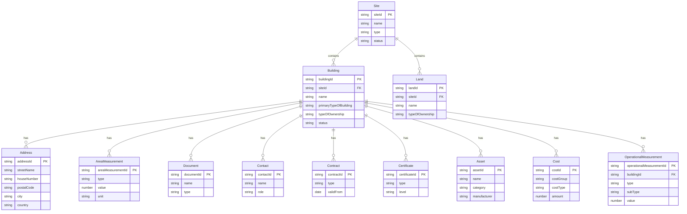

# BBL GIS Immobilienportfolio - Data Model

This document describes the data model for the BBL Immobilienportfolio application.

---

## Table of Contents

1. [Introduction](#1-introduction)
   - 1.1 [Purpose & Scope](#11-purpose--scope)
   - 1.2 [Design Principles](#12-design-principles)
   - 1.3 [Swiss Context](#13-swiss-context)
   - 1.4 [BuildingMinds Alignment](#14-buildingminds-alignment)
2. [Architecture Overview](#2-architecture-overview)
   - 2.1 [Entity Relationship Diagram](#21-entity-relationship-diagram)
   - 2.2 [Entity Hierarchy](#22-entity-hierarchy)
   - 2.3 [Demo vs. Production Implementation](#23-demo-vs-production-implementation)
3. [Core Entities](#3-core-entities)
   - 3.1 [Site (Standort) [Preview]](#31-entity-site-standort-preview)
   - 3.2 [Land (Grundstück)](#32-entity-land-grundstück)
   - 3.3 [Building (Gebäude)](#33-entity-building-gebäude)
   - 3.4 [Address (Adresse)](#34-entity-address-adresse)
4. [Measurement Entities](#4-measurement-entities)
   - 4.1 [Area Measurement (Bemessung)](#41-entity-area-measurement-bemessung)
   - 4.2 [Operational Measurement [Preview]](#42-entity-operational-measurement-preview)
5. [Supporting Entities](#5-supporting-entities)
   - 5.1 [Document (Dokument)](#51-entity-document-dokument)
   - 5.2 [Contact (Kontakt)](#52-entity-contact-kontakt)
   - 5.3 [Asset (Ausstattung)](#53-entity-asset-ausstattung)
   - 5.4 [Contract (Vertrag)](#54-entity-contract-vertrag)
   - 5.5 [Cost (Kosten)](#55-entity-cost-kosten)
6. [Future Entities [Preview]](#6-future-entities-preview)
   - 6.1 [Certificate](#61-certificate)
   - 6.2 [Valuation](#62-valuation)
7. [Appendix A: Reference Tables](#7-appendix-a-reference-tables)
   - A.1 [Shared Enumerations](#a1-shared-enumerations)
   - A.2 [Building Types](#a2-building-types)
   - A.3 [Area Types & SIA Mappings](#a3-area-types--sia-mappings)
   - A.4 [Operational Measurement Types](#a4-operational-measurement-types)
   - A.5 [Document, Contact & Contract Types](#a5-document-contact--contract-types)
   - A.6 [Asset Categories & Cost Groups](#a6-asset-categories--cost-groups)
8. [Appendix B: Data Transformation Guide](#8-appendix-b-data-transformation-guide)
   - B.1 [Source Field Mappings](#b1-source-field-mappings)
   - B.2 [Value Conversions](#b2-value-conversions)
   - B.3 [ISO 8601 Date Handling](#b3-iso-8601-date-handling)
9. [Version History](#9-version-history)
10. [References](#10-references)

---

## 1. Introduction

### 1.1 Purpose & Scope

This document defines the canonical data model for the BBL Immobilienportfolio application, covering the federal real estate portfolio managed by the Swiss Federal Office for Buildings and Logistics (BBL). The model supports:

- Portfolio visualization and GIS-based exploration
- Building master data management
- Area measurements according to Swiss standards
- Operational data tracking (energy, water, waste)
- Document and contract management

### 1.2 Design Principles

The data model follows these core principles:

| Principle | Description |
|-----------|-------------|
| **Extensibility** | Swiss-specific fields are stored in `extensionData` objects, preserving compatibility with the base schema |
| **Traceability** | All entities include `validFrom`/`validUntil` for temporal tracking and `eventType` for domain events |
| **Standards Compliance** | Uses ISO 8601 for dates, ISO 3166 for countries, and aligns with Swiss SIA standards for measurements |
| **Separation of Concerns** | Core building data is separate from operational measurements, documents, and contracts |

### 1.3 Swiss Context

The model incorporates several Switzerland-specific standards and identifiers:

| Standard/Identifier | Description | Usage |
|---------------------|-------------|-------|
| **EGID** | Eidgenössischer Gebäudeidentifikator (Federal Building Identifier) | Unique building identification across federal systems |
| **EGRID** | Eidgenössischer Grundstücksidentifikator (Federal Property Identifier) | Unique land parcel identification |
| **SIA 416** | Swiss standard for areas and volumes in building construction | Area measurement types (BGF, NGF, EBF, etc.) |
| **SIA 380/1** | Energy performance of buildings | Energy reference area (Energiebezugsfläche) |
| **LV95** | Swiss coordinate reference system | Alternative to WGS84 for precise Swiss coordinates |
| **SN 506 511** | Swiss standard for building operating costs | Cost group classification |

### 1.4 BuildingMinds Alignment

This data model is designed for compatibility with the BuildingMinds platform schema. Key alignment points:

- Entity structure follows BuildingMinds conventions (PK/FK relationships, mandatory fields)
- Standard enumerations match BuildingMinds value sets where applicable
- Swiss-specific extensions are isolated in `extensionData` to maintain portability
- Event types follow domain event patterns (`EntityAdded`, `EntityUpdated`, `EntityDeleted`)

---

## 2. Architecture Overview

### 2.1 Entity Relationship Diagram



### 2.2 Entity Hierarchy

Entities are organized into functional groups:

| Layer | Entities | Description |
|-------|----------|-------------|
| **Core** | Site, Land, Building, Address | Primary real estate objects and their locations |
| **Measurement** | Area Measurement, Operational Measurement | Quantitative data (areas, volumes, consumption) |
| **Supporting** | Document, Contact, Asset, Contract, Cost | Administrative and operational associations |
| **Future** | Certificate, Valuation | Planned entities for certifications and appraisals |

### 2.3 Demo vs. Production Implementation

**Current Demo Implementation:**

For the demo stage, all entities are stored in a single GeoJSON file:

```
data/buildings.geojson
```

Related entities (Bemessungen, Dokumente, Kontakte, Verträge) are embedded as arrays within each building's properties.

**Production Implementation:**

In a production system, these would be separate entities with foreign key relationships, enabling:

- Independent lifecycle management per entity
- Many-to-many relationships (e.g., one contact managing multiple buildings)
- Efficient querying and filtering
- Event sourcing for audit trails

---

## 3. Core Entities

### 3.1 Entity: Site (Standort) [Preview]

> **Note:** This entity is not currently implemented in the demo. It is documented here for future implementation planning.

A site represents a logical grouping of buildings, such as a campus, property, or land parcel. Buildings belong to exactly one site.

#### Schema Definition

| Field | PK/FK | Type | Description | Constraints | Alias (EN) | Alias (DE) |
|-------|-------|------|-------------|-------------|------------|------------|
| **siteId** | PK | string | Unique identifier; must either originate from the previous system or be explicitly defined. | **mandatory**, minLength: 1, maxLength: 50 | Site ID | Standort-ID |
| **name** | | string | Name of the site. | **mandatory**, minLength: 1, maxLength: 50 | Site Name | Standortbezeichnung |
| **type** | | string, enum | Type of site. See [Site Types](#a1-shared-enumerations). | **mandatory** | Site Type | Standortart |
| **addressIds** | FK | array[string] | Array of address IDs linked to this site. | **mandatory**, minLength: 1, maxLength: 50 per ID | Addresses | Adressen |
| **validFrom** | | string | The record can be used from this date onwards. ISO 8601 format: `yyyy-mm-ddThh:mm:ssZ` | **mandatory**, minLength: 20 | Valid From | Gültig von |
| **validUntil** | | string | The record is valid until this date. ISO 8601 format: `yyyy-mm-ddThh:mm:ssZ` | **mandatory**, minLength: 20, null allowed | Valid Until | Gültig bis |
| energyRatingIds | FK | array[string] | Array of energy rating IDs. | minLength: 1, maxLength: 50 per ID | Energy Ratings | Energiebewertungen |
| eventType | | string, enum | Type of the event as domain event. Options: `SiteAdded`, `SiteUpdated`, `SiteDeleted` | | Event Type | Ereignistyp |
| extensionData | | object | Extension data for storing any custom data. | JSON object | Extension Data | Erweiterungsdaten |
| siteCode | | string | User specific site code. | minLength: 1, maxLength: 70 | Site Code | Standortcode |
| status | | string | Status of site. | minLength: 1, maxLength: 50 | Status | Status |

#### Swiss Extension Fields (extensionData)

| Field | Type | Description | Alias (EN) | Alias (DE) |
|-------|------|-------------|------------|------------|
| extensionData.egrid | string | Eidgenössischer Grundstücksidentifikator (Federal Property Identifier) | EGRID | EGRID |
| extensionData.parzellenNummer | string | Official parcel number | Parcel Number | Parzellennummer |
| extensionData.grundbuchKreis | string | Land registry district | Land Registry | Grundbuchkreis |
| extensionData.katasterNummer | string | Cadastral number | Cadastral No. | Katasternummer |
| extensionData.teilportfolioGruppe | string | Sub-portfolio group (e.g., "Bundesverwaltung") | Portfolio Group | Teilportfolio Gruppe |

#### Example: Site Object

```json
{
  "siteId": "BE-3003-1001",
  "name": "Bundesplatz Parzelle A",
  "type": "Office",
  "addressIds": ["BBL-001-ADDR-1"],
  "validFrom": "1900-01-01T00:00:00Z",
  "validUntil": null,
  "siteCode": "BPL-A",
  "status": "Aktiv",
  "extensionData": {
    "egrid": "CH123456789012",
    "teilportfolioGruppe": "Bundesverwaltung",
    "grundbuchKreis": "Bern",
    "parzellenNummer": "1001"
  }
}
```

---

### 3.2 Entity: Land (Grundstück)

Land represents a parcel of land or plot that belongs to a site. In the current demo, land information is partially embedded in building properties (`grundstueck_id`, `grundstueck_name`). In a production system, Land would be a separate entity allowing multiple land parcels per site.

#### Schema Definition

| Field | PK/FK | Type | Description | Constraints | Alias (EN) | Alias (DE) |
|-------|-------|------|-------------|-------------|------------|------------|
| **landId** | PK | string | Unique identifier; must either originate from the previous system or be explicitly defined. | **mandatory**, minLength: 1, maxLength: 50 | Land ID | Grundstück-ID |
| **name** | | string | Name of land (e.g., park, garden, parking). | **mandatory**, minLength: 1, maxLength: 200 | Land Name | Grundstückbezeichnung |
| **siteId** | FK | string | Refers to the site which the land belongs to. | **mandatory**, minLength: 1, maxLength: 50 | Site ID | Standort-ID |
| **typeOfOwnership** | | string, enum | Is the land owned or leased? See [Ownership Types](#a1-shared-enumerations). | **mandatory** | Ownership | Eigentum |
| **validFrom** | | string | The record can be used from this date onwards. ISO 8601 format: `yyyy-mm-ddThh:mm:ssZ` | **mandatory**, minLength: 20 | Valid From | Gültig von |
| **validUntil** | | string | The record is valid until this date. ISO 8601 format: `yyyy-mm-ddThh:mm:ssZ` | **mandatory**, minLength: 20, null allowed | Valid Until | Gültig bis |
| addressIds | FK | array[string] | Array of address IDs linked to this land. | minLength: 1, maxLength: 50 per ID | Addresses | Adressen |
| eventType | | string, enum | Type of the event as domain event. Options: `LandAdded`, `LandUpdated`, `LandDeleted` | | Event Type | Ereignistyp |
| extensionData | | object | Extension data for storing any custom data. | JSON object | Extension Data | Erweiterungsdaten |
| landCode | | string | User specific land code. | minLength: 1, maxLength: 70 | Land Code | Grundstückcode |
| landCoverage | | string | Development level of land. | minLength: 1, maxLength: 50 | Land Coverage | Bebauungsgrad |
| landParcelNr | | string | District/zoning number registered for the plot of land. | minLength: 1, maxLength: 50 | Parcel Number | Parzellennummer |
| selfUse | | boolean | Is the land self-used? | | Self Use | Eigennutzung |
| status | | string | Status of land. | minLength: 1, maxLength: 50 | Status | Status |
| tenantStructure | | string, enum | Tenant structure. See [Tenant Structure](#a1-shared-enumerations). | | Tenant Structure | Mieterstruktur |
| valuationIds | FK | array[string] | Array of valuation IDs. | minLength: 1, maxLength: 50 per ID | Valuations | Bewertungen |

#### Swiss Extension Fields (extensionData)

| Field | Type | Description | Alias (EN) | Alias (DE) |
|-------|------|-------------|------------|------------|
| extensionData.egrid | string | Federal property identifier (country-specific) | EGRID | EGRID |

#### Example: Land Object

```json
{
  "landId": "BE-3003-1001",
  "name": "Bundesplatz Parzelle A",
  "typeOfOwnership": "Owner",
  "validFrom": "1900-01-01T00:00:00Z",
  "validUntil": null,
  "addressIds": ["BBL-001-ADDR-1"],
  "status": "Aktiv",
  "extensionData": {
    "egrid": "CH123456789012"
  }
}
```

---

### 3.3 Entity: Building (Gebäude)

The building is the core entity representing a physical structure in the portfolio.

#### Schema Definition

| Field | PK/FK | Type | Description | Constraints | Alias (EN) | Alias (DE) |
|-------|-------|------|-------------|-------------|------------|------------|
| **buildingId** | PK | string | Unique identifier; must either originate from the previous system or be explicitly defined. | **mandatory**, minLength: 1, maxLength: 50 | Building ID | Objekt-ID |
| **name** | | string | User specific building name (e.g., "Bundeshaus West", "EMEA Headquarter"). | **mandatory**, minLength: 1, maxLength: 200 | Building Name | Bezeichnung |
| **siteId** | FK | string | Refers to the site which the building belongs to. | **mandatory**, minLength: 1, maxLength: 50 | Site ID | Standort-ID |
| **primaryTypeOfBuilding** | | string, enum | Primary type of building use. See [Building Types](#a2-building-types). | **mandatory** | Building Type | Objektart 1 |
| **typeOfOwnership** | | string, enum | Is the building owned or leased? See [Ownership Types](#a1-shared-enumerations). | **mandatory** | Ownership | Art Eigentum |
| **validFrom** | | string | The record can be used from this date onwards. ISO 8601 format: `yyyy-mm-ddThh:mm:ssZ` | **mandatory**, minLength: 20 | Valid From | Gültig von |
| **validUntil** | | string | The record is valid until this date. ISO 8601 format: `yyyy-mm-ddThh:mm:ssZ` | **mandatory**, minLength: 20, null allowed | Valid Until | Gültig bis |
| addressIds | FK | array[string] | Array of address IDs linked to this building. | minLength: 1, maxLength: 50 per ID | Addresses | Adressen |
| airConditioning | | boolean | Does the building have air conditioning? | | Air Conditioning | Klimaanlage |
| buildingCode | | string | User specific building code. | minLength: 1, maxLength: 70 | Building Code | Objektcode |
| buildingPermitDate | | string | Building permit date. ISO 8601 format. | minLength: 20 | Permit Date | Baubewilligung |
| certificateIds | FK | array[string] | Array of certificate IDs. | minLength: 1, maxLength: 50 per ID | Certificates | Zertifikate |
| constructionYear | | string | Year of construction. ISO 8601 format. Use `yyyy-01-01T00:00:00Z` if only year is known. | minLength: 20 | Construction Year | Baujahr |
| electricVehicleChargingStations | | number | Number of EV charging stations. | maximum: 9999 | EV Charging | E-Ladestationen |
| energyEfficiencyClass | | string | Energy Efficiency Class of Building (e.g., "A", "B", "C"). | minLength: 1, maxLength: 50 | Energy Class | Energieklasse |
| energyRatingIds | FK | array[string] | Array of energy rating IDs. | minLength: 1, maxLength: 50 per ID | Energy Ratings | Energiebewertungen |
| eventType | | string, enum | Type of the event as domain event. Options: `BuildingAdded`, `BuildingUpdated`, `BuildingDeleted` | | Event Type | Ereignistyp |
| expectedLifeEndDate | | string | Expected end date of building lifecycle. ISO 8601 format. | minLength: 20 | Life End Date | Nutzungsende |
| extensionData | | object | Extension data for storing any custom data. | JSON object | Extension Data | Erweiterungsdaten |
| fossilFuelExposure | | string, enum | Fossil fuel exposure type. See [Fossil Fuel Exposure](#a1-shared-enumerations). | | Fossil Fuel Exposure | Fossile Brennstoffe |
| monumentProtection | | boolean | Is the building declared as a protected monument? | | Monument Protection | Denkmalschutz |
| netZeroEnergyBuilding | | boolean | Is the building a net zero energy building? | | Net Zero Building | Nullenergiegebäude |
| numberOfEmployees | | number | Number of employees. | maximum: 999999 | Employees | Mitarbeiter |
| parkingSpaces | | number | Number of parking spaces. | maximum: 9999 | Parking Spaces | Parkplätze |
| percentageOfOwnership | | number | Percentage of ownership. | maximum: 100 | Ownership % | Eigentumsanteil |
| primaryEnergyType | | string, enum | Primary type of energy used. See [Energy Types](#a1-shared-enumerations). | | Energy Type | Energieart |
| primaryWaterType | | string | Type of water used. | minLength: 1, maxLength: 50 | Water Type | Wasserart |
| secondaryHeatingType | | string, enum | Secondary type of heating. See [Heating Types](#a1-shared-enumerations). | | Heating Type | Heizungsart |
| secondaryTypeOfBuilding | | string, enum | Secondary type of building use. See [Building Types](#a2-building-types). | | Building Type 2 | Objektart 2 |
| selfUse | | boolean | Is the building self-used? | | Self Use | Eigennutzung |
| status | | string | Status of building (e.g., "In Betrieb", "In Renovation"). | minLength: 1, maxLength: 50 | Status | Status |
| tenantStructure | | string, enum | Tenant structure. See [Tenant Structure](#a1-shared-enumerations). | | Tenant Structure | Mieterstruktur |
| valuationIds | FK | array[string] | Array of valuation IDs. | minLength: 1, maxLength: 50 per ID | Valuations | Bewertungen |
| yearOfLastRefurbishment | | string | Year of last refurbishment. ISO 8601 format. | minLength: 20 | Refurbishment | Sanierung |

#### Swiss Extension Fields (extensionData)

| Field | Type | Description | Alias (EN) | Alias (DE) |
|-------|------|-------------|------------|------------|
| extensionData.numberOfFloors | number | Number of floors/stories in the building | Floors | Anzahl Geschosse |
| extensionData.responsiblePerson | string | Name of responsible person for the building | Responsible | Verantwortlich |
| extensionData.egid | string | Federal building identifier (country-specific) | EGID | EGID |
| extensionData.egrid | string | Federal property identifier (country-specific) | EGRID | EGRID |
| extensionData.portfolio | string | Sub-portfolio category | Portfolio | Teilportfolio |
| extensionData.portfolioGroup | string | Portfolio group | Portfolio Group | Teilportfolio Gruppe |
| extensionData.heatingGenerator | string | Heating generator type | Heating System | Wärmeerzeuger |
| extensionData.heatingSource | string | Heating source | Heat Source | Wärmequelle |
| extensionData.hotWater | string | Hot water system description | Hot Water | Warmwasser |

#### Example: Building Object

```json
{
  "buildingId": "BBL-001",
  "name": "Bundeshaus West",
  "primaryTypeOfBuilding": "Office Corporate",
  "secondaryTypeOfBuilding": "Mixed Use Office/Retail",
  "typeOfOwnership": "Owner",
  "validFrom": "1902-06-01T00:00:00Z",
  "validUntil": null,
  "addressIds": ["ADDR-001"],
  "constructionYear": "1902-01-01T00:00:00Z",
  "buildingPermitDate": "1898-03-15T00:00:00Z",
  "yearOfLastRefurbishment": "2019-01-01T00:00:00Z",
  "parkingSpaces": 45,
  "electricVehicleChargingStations": 8,
  "monumentProtection": true,
  "status": "In Betrieb",
  "energyEfficiencyClass": "C",
  "extensionData": {
    "numberOfFloors": 5,
    "egid": "301001234",
    "portfolio": "Verwaltungsgebäude",
    "portfolioGroup": "Bundesverwaltung",
    "heatingGenerator": "Fernwärme",
    "heatingSource": "Fernwärmenetz Stadt Bern",
    "hotWater": "Zentral (Fernwärme)"
  }
}
```

---

### 3.4 Entity: Address (Adresse)

Addresses represent the physical location of a building. A building can have multiple addresses (e.g., corner buildings with entrances on different streets).

#### Schema Definition

| Field | PK/FK | Type | Description | Constraints | Alias (EN) | Alias (DE) |
|-------|-------|------|-------------|-------------|------------|------------|
| **addressId** | PK | string | Unique identifier; must either originate from the previous system or be explicitly defined. | **mandatory**, minLength: 1, maxLength: 50 | Address ID | Adress-ID |
| **city** | | string | Any official settlement including cities, towns, villages, hamlets, localities, etc. | **mandatory**, minLength: 1, maxLength: 100 | City | Ort |
| **country** | | string, enum | Sovereign nations with ISO-3166 code. Common: `CH`, `DE`, `FR`, `IT`, `AT`, `BE`, `US` | **mandatory** | Country | Land |
| **type** | | string, enum | Type of address. See [Address Types](#a1-shared-enumerations). | **mandatory** | Address Type | Adressart |
| **geoCoordinates.geoCoordinateId** | PK | string | Unique identifier for the coordinate set. | **mandatory**, minLength: 1, maxLength: 50 | Coordinate ID | Koordinaten-ID |
| geoCoordinates.coordinateReferenceSystem | | string | Specific coordinate reference system used (e.g., "WGS84", "LV95"). | minLength: 1, maxLength: 50 | Reference System | Referenzsystem |
| geoCoordinates.latitude | | number | Latitude coordinate (WGS84: -90 to 90). | | Latitude | Breitengrad |
| geoCoordinates.longitude | | number | Longitude coordinate (WGS84: -180 to 180). | | Longitude | Längengrad |
| additionalInformation | | string | Additional information (building name, door number, etc.). | minLength: 1, maxLength: 500 | Additional Info | Zusatzinformation |
| apartmentOrUnit | | string | Unit or apartment number. | minLength: 1, maxLength: 50 | Unit/Apt | Wohnung/Einheit |
| district | | string | Borough or district within a city. | minLength: 1, maxLength: 50 | District | Bezirk |
| eventType | | string, enum | Type of the event as domain event. Options: `AddressAdded`, `AddressUpdated` | | Event Type | Ereignistyp |
| extensionData | | object | Extension data for storing any custom data. | JSON object | Extension Data | Erweiterungsdaten |
| houseNumber | | string | House number of the street. | minLength: 1, maxLength: 50 | House Number | Hausnummer |
| postalCode | | string | Postal code for mail sorting. | minLength: 1, maxLength: 15 | Postal Code | PLZ |
| stateProvincePrefecture | | string | First-level administrative division (state, province, canton). | minLength: 1, maxLength: 50 | State/Province | Region/Kanton |
| streetName | | string | Name of the street. | minLength: 1, maxLength: 150 | Street | Strasse |

#### Swiss Extension Fields (extensionData)

| Field | Type | Description | Alias (EN) | Alias (DE) |
|-------|------|-------------|------------|------------|
| extensionData.formattedAddress | string | Pre-formatted full address string | Full Address | Vollständige Adresse |

#### Example: Address Object

```json
{
  "addressId": "BBL-001-ADDR-1",
  "type": "Primary",
  "streetName": "Bundesplatz",
  "houseNumber": "3",
  "postalCode": "3003",
  "city": "Bern",
  "stateProvincePrefecture": "Kanton Bern",
  "country": "CH",
  "geoCoordinates": {
    "geoCoordinateId": "BBL-001-GEO-1",
    "coordinateReferenceSystem": "WGS84",
    "latitude": 46.9466,
    "longitude": 7.4448
  },
  "extensionData": {
    "formattedAddress": "Bundesplatz 3, 3003 Bern"
  }
}
```

---

## 4. Measurement Entities

### 4.1 Entity: Area Measurement (Bemessung)

Area measurements capture floor areas, volumes, and other quantitative measurements for buildings, floors, spaces, or sites. In the current demo, measurements are embedded in the `bemessungen` array within each building.

#### Schema Definition

| Field | PK/FK | Type | Description | Constraints | Alias (EN) | Alias (DE) |
|-------|-------|------|-------------|-------------|------------|------------|
| **areaMeasurementId** | PK | string | Unique identifier; must either originate from the previous system or be explicitly defined. | **mandatory**, minLength: 1, maxLength: 50 | Measurement ID | Bemessungs-ID |
| **type** | | string, enum | Type of the standard area. See [Area Types](#a3-area-types--sia-mappings). | **mandatory** | Area Type | Flächenart |
| **value** | | number | Value of measurement. | **mandatory** | Value | Wert |
| **unit** | | string, enum | Unit area is measured with. See [Area Measurement Units](#a3-area-types--sia-mappings). | **mandatory** | Unit | Einheit |
| **validFrom** | | string | The record can be used from this date onwards. ISO 8601 format: `yyyy-mm-ddThh:mm:ssZ` | **mandatory**, minLength: 20 | Valid From | Gültig von |
| **validUntil** | | string | The record is valid until this date. ISO 8601 format: `yyyy-mm-ddThh:mm:ssZ` | **mandatory**, minLength: 20, null allowed | Valid Until | Gültig bis |
| **bmEstimation** | | boolean | Is the data estimated by BuildingMinds? | **mandatory** | BM Estimation | BM-Schätzung |
| accuracy | | string, enum | Accuracy of area measurement. See [Area Measurement Accuracy](#a3-area-types--sia-mappings). | | Accuracy | Genauigkeit |
| buildingIds | FK | array[string] | Array of building IDs this measurement belongs to. | minLength: 1, maxLength: 50 per ID | Buildings | Gebäude |
| eventType | | string, enum | Type of the event as domain event. Options: `AreaMeasurementAdded`, `AreaMeasurementUpdated`, `AreaMeasurementDeleted` | | Event Type | Ereignistyp |
| extensionData | | object | Extension data for storing any custom data. | JSON object | Extension Data | Erweiterungsdaten |
| floorIds | FK | array[string] | Array of floor IDs. | minLength: 1, maxLength: 50 per ID | Floors | Geschosse |
| landIds | FK | array[string] | Array of land IDs. | minLength: 1, maxLength: 50 per ID | Land Parcels | Grundstücke |
| rentalUnit | FK | array[string] | Array of rental unit IDs. | minLength: 1, maxLength: 50 per ID | Rental Units | Mieteinheiten |
| siteIds | FK | array[string] | Array of site IDs. | minLength: 1, maxLength: 50 per ID | Sites | Standorte |
| spaceIds | FK | array[string] | Array of space IDs. | minLength: 1, maxLength: 50 per ID | Spaces | Räume |
| standard | | string, enum | Area measurement standard. See [Area Measurement Standards](#a3-area-types--sia-mappings). | | Standard | Norm |

#### Swiss Extension Fields (extensionData)

| Field | Type | Description | Alias (EN) | Alias (DE) |
|-------|------|-------------|------------|------------|
| extensionData.siaStandard | string | Swiss SIA standard reference (e.g., "SIA 416", "SIA 380/1") | SIA Standard | SIA-Norm |
| extensionData.source | string | Data source (e.g., "CAD/BIM", "Vermessung", "Schätzmodell", "Manuell") | Source | Quelle |
| extensionData.originalUnit | string | Original unit before conversion (e.g., "m²", "m³", "Stk") | Original Unit | Urspr. Einheit |
| extensionData.originalType | string | Original German area type name | Original Type | Urspr. Flächenart |
| extensionData.measurementCategory | string | Category for non-standard measurements (e.g., "volume", "count") | Category | Kategorie |

#### Example: Area Measurement Object

```json
{
  "areaMeasurementId": "BBL-001-M1",
  "type": "Gross floor area",
  "value": 15000,
  "unit": "sqm",
  "validFrom": "2019-03-15T00:00:00Z",
  "validUntil": null,
  "bmEstimation": false,
  "accuracy": "Measured",
  "standard": "NA",
  "buildingIds": ["BBL-001"],
  "extensionData": {
    "siaStandard": "SIA 416",
    "source": "CAD/BIM",
    "originalUnit": "m²",
    "originalType": "Bruttogeschossfläche"
  }
}
```

#### Example: Volume Measurement (Swiss Extension)

For measurements that don't fit the standard area types (volumes, counts):

```json
{
  "areaMeasurementId": "BBL-001-M4",
  "type": "NA",
  "value": 52500,
  "unit": "sqm",
  "validFrom": "2019-03-15T00:00:00Z",
  "validUntil": null,
  "bmEstimation": false,
  "accuracy": "Measured",
  "standard": "NA",
  "buildingIds": ["BBL-001"],
  "extensionData": {
    "siaStandard": "SIA 416",
    "source": "CAD/BIM",
    "originalUnit": "m³",
    "originalType": "Volumen",
    "measurementCategory": "volume"
  }
}
```

---

### 4.2 Entity: Operational Measurement [Preview]

> **Note:** This entity is not currently implemented in the demo. It is documented here for future implementation planning.

Operational measurements track resource consumption (energy, water, waste) and emissions data for buildings. This entity enables ESG reporting, carbon footprint calculations, and sustainability monitoring.

#### Schema Definition

| Field | PK/FK | Type | Description | Constraints | Alias (EN) | Alias (DE) |
|-------|-------|------|-------------|-------------|------------|------------|
| **operationalMeasurementId** | PK | string | Unique identifier; must either originate from the previous system or be explicitly defined. | **mandatory**, minLength: 1, maxLength: 50 | Measurement ID | Betriebs-ID |
| **buildingId** | FK | string | Unique identifier of the building this measurement belongs to. | **mandatory**, minLength: 1, maxLength: 50 | Building ID | Objekt-ID |
| **type** | | string, enum | General type of operational measurement. See [Operational Measurement Types](#a4-operational-measurement-types). | **mandatory** | Type | Art |
| **subType** | | string, enum | Specific type of operational measurement. See [Operational Measurement SubTypes](#a4-operational-measurement-types). | **mandatory** | Sub Type | Unterart |
| **value** | | number | Value of the measurement. | **mandatory** | Value | Wert |
| **unit** | | string, enum | Unit of measurement. See [Operational Measurement Units](#a4-operational-measurement-types). | **mandatory** | Unit | Einheit |
| **validFrom** | | string | Date validity starts. ISO 8601 format: `yyyy-mm-ddThh:mm:ssZ` | **mandatory**, minLength: 20 | Valid From | Gültig von |
| **validUntil** | | string | Date validity ends. ISO 8601 format: `yyyy-mm-ddThh:mm:ssZ` | **mandatory**, minLength: 20 | Valid Until | Gültig bis |
| **procuredBy** | | string, enum | Operational control information. See [Procurement Types](#a4-operational-measurement-types). | **mandatory** | Procured By | Beschaffung |
| **purpose** | | string, enum | Purpose of resource consumption. See [Purpose Types](#a4-operational-measurement-types). | **mandatory** | Purpose | Verwendungszweck |
| **spaceType** | | string, enum | Reference to specific space type. See [Space Types](#a4-operational-measurement-types). | **mandatory** | Space Type | Raumtyp |
| accuracy | | string, enum | Accuracy of measurement. See [Accuracy Options](#a4-operational-measurement-types). | | Accuracy | Genauigkeit |
| customerInfoSource | | string, enum | Source of data. See [Data Source Types](#a4-operational-measurement-types). | | Data Source | Datenquelle |
| dataProvider | | string | Name of the data provider. | minLength: 1, maxLength: 50 | Data Provider | Datenanbieter |
| eventType | | string, enum | Type of the event as domain event. Options: `OperationalMeasurementAdded`, `OperationalMeasurementUpdated`, `OperationalMeasurementDeleted` | | Event Type | Ereignistyp |
| extensionData | | object | Extension data for storing any custom data. | JSON object | Extension Data | Erweiterungsdaten |
| isAutoApproved | | boolean | Determines whether this value is auto approved or requires approval. | | Auto Approved | Auto-genehmigt |
| lifeCycleAssessment | | array[string] | Life cycle assessment stages (ISO 14040). Options: `A1`, `A2`, `A3`, `A4`, `A5`, `B1`, `B2`, `B3`, `B4`, `B5`, `B6`, `B7`, `C1`, `C2`, `C3`, `C4`, `D` | | LCA Stages | LCA-Phasen |
| measurementDate | | string | Date measurement was taken. ISO 8601 format. | minLength: 20 | Measurement Date | Messdatum |
| name | | string | Any descriptive name. | | Name | Bezeichnung |
| parentId | FK | string | Parent entity ID. | | Parent ID | Übergeordnete ID |
| postingDate | | string | Date measurement was posted. ISO 8601 format. | minLength: 20 | Posting Date | Buchungsdatum |
| sensorId | | string | ID of meter for this reading. | | Sensor ID | Zähler-ID |
| valuationIds | FK | array[string] | Array of valuation IDs. | | Valuations | Bewertungen |

#### Example: Operational Measurement Object

```json
{
  "operationalMeasurementId": "BBL-001-OPM-001",
  "buildingId": "BBL-001",
  "type": "Energy",
  "subType": "District heating",
  "value": 125000,
  "unit": "kWh",
  "validFrom": "2024-01-01T00:00:00Z",
  "validUntil": "2024-12-31T00:00:00Z",
  "procuredBy": "Procured by third party",
  "purpose": "Space heating",
  "spaceType": "Whole building",
  "accuracy": "Metered",
  "customerInfoSource": "Invoice",
  "dataProvider": "Energie Wasser Bern",
  "measurementDate": "2024-12-01T00:00:00Z",
  "lifeCycleAssessment": ["B6"]
}
```

---

## 5. Supporting Entities

### 5.1 Entity: Document (Dokument)

Documents represent files and records associated with a building, such as floor plans, certificates, permits, and technical documentation.

#### Schema Definition

| Field | PK/FK | Type | Description | Constraints | Alias (EN) | Alias (DE) |
|-------|-------|------|-------------|-------------|------------|------------|
| **documentId** | PK | string | Unique identifier for the document. | **mandatory**, minLength: 1, maxLength: 50 | Document ID | Dokument-ID |
| **name** | | string | Title or name of the document. | **mandatory**, minLength: 1, maxLength: 200 | Document Name | Dokumentname |
| **type** | | string, enum | Type of document. See [Document Types](#a5-document-contact--contract-types). | **mandatory** | Document Type | Dokumenttyp |
| **buildingIds** | FK | array[string] | Array of building IDs this document belongs to. | **mandatory**, minLength: 1 | Buildings | Gebäude |
| **validFrom** | | string | Document date or effective date. ISO 8601 format. | **mandatory**, minLength: 20 | Valid From | Gültig von |
| eventType | | string, enum | Type of the event as domain event. Options: `DocumentAdded`, `DocumentUpdated`, `DocumentDeleted` | | Event Type | Ereignistyp |
| extensionData | | object | Extension data for storing any custom data. | JSON object | Extension Data | Erweiterungsdaten |
| fileFormat | | string | File format (e.g., "PDF", "DWG", "IFC"). | minLength: 1, maxLength: 20 | File Format | Dateiformat |
| fileSize | | string | File size as string (e.g., "2.4 MB"). | minLength: 1, maxLength: 20 | File Size | Dateigrösse |
| url | | string | URL or path to the document file. | minLength: 1, maxLength: 500 | URL | URL |
| description | | string | Description or notes about the document. | minLength: 1, maxLength: 1000 | Description | Beschreibung |
| version | | string | Document version identifier. | minLength: 1, maxLength: 20 | Version | Version |
| validUntil | | string | Expiry date for time-limited documents. ISO 8601 format. | minLength: 20, null allowed | Valid Until | Gültig bis |

#### Example: Document Object

```json
{
  "documentId": "BBL-001-D1",
  "name": "Grundriss Erdgeschoss",
  "type": "Grundriss",
  "buildingIds": ["BBL-001"],
  "validFrom": "2019-03-15T00:00:00Z",
  "fileFormat": "PDF",
  "fileSize": "2.4 MB",
  "url": "/documents/BBL-001/grundriss-eg.pdf"
}
```

---

### 5.2 Entity: Contact (Kontakt)

Contacts represent persons associated with a building, such as property managers, caretakers, or portfolio managers.

#### Schema Definition

| Field | PK/FK | Type | Description | Constraints | Alias (EN) | Alias (DE) |
|-------|-------|------|-------------|-------------|------------|------------|
| **contactId** | PK | string | Unique identifier for the contact. | **mandatory**, minLength: 1, maxLength: 50 | Contact ID | Kontakt-ID |
| **name** | | string | Full name of the contact person. | **mandatory**, minLength: 1, maxLength: 200 | Name | Name |
| **role** | | string, enum | Role or function of the contact. See [Contact Roles](#a5-document-contact--contract-types). | **mandatory** | Role | Rolle |
| **buildingIds** | FK | array[string] | Array of building IDs this contact is associated with. | **mandatory**, minLength: 1 | Buildings | Gebäude |
| eventType | | string, enum | Type of the event as domain event. Options: `ContactAdded`, `ContactUpdated`, `ContactDeleted` | | Event Type | Ereignistyp |
| extensionData | | object | Extension data for storing any custom data. | JSON object | Extension Data | Erweiterungsdaten |
| organisation | | string | Organisation or department. | minLength: 1, maxLength: 200 | Organisation | Organisation |
| phone | | string | Phone number. | minLength: 1, maxLength: 30 | Phone | Telefon |
| email | | string | Email address. | minLength: 1, maxLength: 100, format: email | Email | E-Mail |
| isPrimary | | boolean | Is this the primary contact for the building? | | Primary Contact | Hauptkontakt |
| validFrom | | string | Contact assignment start date. ISO 8601 format. | minLength: 20 | Valid From | Gültig von |
| validUntil | | string | Contact assignment end date. ISO 8601 format. | minLength: 20, null allowed | Valid Until | Gültig bis |

#### Example: Contact Object

```json
{
  "contactId": "BBL-001-K1",
  "name": "Anna Müller",
  "role": "Objektverantwortliche",
  "buildingIds": ["BBL-001"],
  "organisation": "BBL Immobilienmanagement",
  "phone": "+41 58 462 12 34",
  "email": "anna.mueller@bbl.admin.ch",
  "isPrimary": true
}
```

---

### 5.3 Entity: Asset (Ausstattung)

Assets represent technical equipment, installations, and building components that require maintenance or tracking.

#### Schema Definition

| Field | PK/FK | Type | Description | Constraints | Alias (EN) | Alias (DE) |
|-------|-------|------|-------------|-------------|------------|------------|
| **assetId** | PK | string | Unique identifier for the asset. | **mandatory**, minLength: 1, maxLength: 50 | Asset ID | Ausstattungs-ID |
| **name** | | string | Name or designation of the asset. | **mandatory**, minLength: 1, maxLength: 200 | Asset Name | Bezeichnung |
| **category** | | string, enum | Category of the asset. See [Asset Categories](#a6-asset-categories--cost-groups). | **mandatory** | Category | Kategorie |
| **buildingIds** | FK | array[string] | Array of building IDs this asset belongs to. | **mandatory**, minLength: 1 | Buildings | Gebäude |
| eventType | | string, enum | Type of the event as domain event. Options: `AssetAdded`, `AssetUpdated`, `AssetDeleted` | | Event Type | Ereignistyp |
| extensionData | | object | Extension data for storing any custom data. | JSON object | Extension Data | Erweiterungsdaten |
| manufacturer | | string | Manufacturer or vendor. | minLength: 1, maxLength: 200 | Manufacturer | Hersteller |
| installationYear | | number | Year of installation. | minimum: 1800, maximum: 2100 | Installation Year | Einbaujahr |
| location | | string | Location within the building. | minLength: 1, maxLength: 200 | Location | Standort |
| serialNumber | | string | Serial number or asset tag. | minLength: 1, maxLength: 100 | Serial Number | Seriennummer |
| status | | string | Current status (e.g., "In Betrieb", "Ausser Betrieb"). | minLength: 1, maxLength: 50 | Status | Status |
| maintenanceInterval | | string | Maintenance interval (e.g., "Jährlich", "Monatlich"). | minLength: 1, maxLength: 50 | Maintenance Interval | Wartungsintervall |
| lastMaintenanceDate | | string | Date of last maintenance. ISO 8601 format. | minLength: 20 | Last Maintenance | Letzte Wartung |
| nextMaintenanceDate | | string | Date of next scheduled maintenance. ISO 8601 format. | minLength: 20 | Next Maintenance | Nächste Wartung |

#### Example: Asset Object

```json
{
  "assetId": "BBL-001-A1",
  "name": "Fernwärmeübergabestation",
  "category": "HVAC",
  "buildingIds": ["BBL-001"],
  "manufacturer": "Siemens AG",
  "installationYear": 2019,
  "location": "Untergeschoss Technikraum",
  "status": "In Betrieb",
  "maintenanceInterval": "Jährlich"
}
```

---

### 5.4 Entity: Contract (Vertrag)

Contracts represent service agreements, maintenance contracts, and other contractual arrangements associated with a building.

#### Schema Definition

| Field | PK/FK | Type | Description | Constraints | Alias (EN) | Alias (DE) |
|-------|-------|------|-------------|-------------|------------|------------|
| **contractId** | PK | string | Unique identifier for the contract. | **mandatory**, minLength: 1, maxLength: 50 | Contract ID | Vertrags-ID |
| **type** | | string, enum | Type of contract. See [Contract Types](#a5-document-contact--contract-types). | **mandatory** | Contract Type | Vertragsart |
| **buildingIds** | FK | array[string] | Array of building IDs this contract belongs to. | **mandatory**, minLength: 1 | Buildings | Gebäude |
| **validFrom** | | string | Contract start date. ISO 8601 format. | **mandatory**, minLength: 20 | Valid From | Vertragsbeginn |
| eventType | | string, enum | Type of the event as domain event. Options: `ContractAdded`, `ContractUpdated`, `ContractDeleted` | | Event Type | Ereignistyp |
| extensionData | | object | Extension data for storing any custom data. | JSON object | Extension Data | Erweiterungsdaten |
| contractPartner | | string | Name of the contract partner or vendor. | minLength: 1, maxLength: 200 | Contract Partner | Vertragspartner |
| validUntil | | string | Contract end date. ISO 8601 format. | minLength: 20, null allowed | Valid Until | Vertragsende |
| amount | | number | Contract value or annual amount. | | Amount | Betrag |
| currency | | string | Currency code (ISO 4217). | minLength: 3, maxLength: 3 | Currency | Währung |
| status | | string | Current contract status (e.g., "Aktiv", "Beendet"). | minLength: 1, maxLength: 50 | Status | Status |

#### Example: Contract Object

```json
{
  "contractId": "BBL-001-V1",
  "type": "Wartungsvertrag",
  "buildingIds": ["BBL-001"],
  "validFrom": "2020-01-01T00:00:00Z",
  "validUntil": "2025-12-31T00:00:00Z",
  "contractPartner": "Siemens Building Technologies AG",
  "amount": 85000,
  "currency": "CHF",
  "status": "Aktiv"
}
```

---

### 5.5 Entity: Cost (Kosten)

Costs represent operating expenses, utility costs, and other recurring costs associated with a building. Costs are typically categorized using standard cost group codes.

#### Schema Definition

| Field | PK/FK | Type | Description | Constraints | Alias (EN) | Alias (DE) |
|-------|-------|------|-------------|-------------|------------|------------|
| **costId** | PK | string | Unique identifier for the cost entry. | **mandatory**, minLength: 1, maxLength: 50 | Cost ID | Kosten-ID |
| **costGroup** | | string | Cost group code (e.g., DIN 18960 or Swiss SN 506 511). | **mandatory**, minLength: 1, maxLength: 10 | Cost Group | Kostengruppe |
| **costType** | | string | Description of the cost type. | **mandatory**, minLength: 1, maxLength: 200 | Cost Type | Kostenart |
| **buildingIds** | FK | array[string] | Array of building IDs this cost belongs to. | **mandatory**, minLength: 1 | Buildings | Gebäude |
| eventType | | string, enum | Type of the event as domain event. Options: `CostAdded`, `CostUpdated`, `CostDeleted` | | Event Type | Ereignistyp |
| extensionData | | object | Extension data for storing any custom data. | JSON object | Extension Data | Erweiterungsdaten |
| amount | | number | Cost amount. | | Amount | Betrag |
| unit | | string | Unit of the cost (e.g., "CHF/Jahr", "CHF/Monat"). | minLength: 1, maxLength: 20 | Unit | Einheit |
| currency | | string | Currency code (ISO 4217). | minLength: 3, maxLength: 3 | Currency | Währung |
| period | | string, enum | Cost period. See [Cost Periods](#a6-asset-categories--cost-groups). | | Period | Periode |
| referenceDate | | string | Reference date for the cost entry. ISO 8601 format. | minLength: 20 | Reference Date | Stichtag |

#### Example: Cost Object

```json
{
  "costId": "BBL-001-K1",
  "costGroup": "311",
  "costType": "Stromversorgung",
  "buildingIds": ["BBL-001"],
  "amount": 185000,
  "unit": "CHF/Jahr",
  "currency": "CHF",
  "period": "Annual",
  "referenceDate": "2024-12-01T00:00:00Z"
}
```

---

## 6. Future Entities [Preview]

The following entities are planned for future implementation:

### 6.1 Certificate

Building certifications (LEED, BREEAM, Minergie, etc.) with associated levels and validity periods.

**Relationship:** 1 Building → n Certificates

### 6.2 Valuation

Property valuations including market value, book value, and appraisal data.

**Relationship:** 1 Building → n Valuations

---

## 7. Appendix A: Reference Tables

### A.1 Shared Enumerations

#### Ownership Types

Used by: Land, Building

| Value | Description |
|-------|-------------|
| `Owner` | Property is owned |
| `Tenant` | Property is leased/rented |

#### Tenant Structure

Used by: Land, Building

| Value | Description |
|-------|-------------|
| `Single-tenant` | Single tenant occupancy |
| `Multi-tenant` | Multiple tenant occupancy |

#### Address Types

Used by: Address

| Value | Description |
|-------|-------------|
| `Primary` | Primary/main address |
| `Other` | Secondary or alternative address |

#### Site Types

Used by: Site

| Value | Description |
|-------|-------------|
| `Education` | Educational facilities |
| `Health Care` | Healthcare facilities |
| `Hotel` | Hotel properties |
| `Industrial` | Industrial sites |
| `Lodging` | Lodging facilities |
| `Leisure & Recreation` | Leisure and recreation |
| `Mixed Use` | Mixed-use developments |
| `Office` | Office buildings |
| `Residential` | Residential properties |
| `Retail` | Retail properties |
| `Technology/Science` | Technology and science facilities |
| `Other` | Other property types |

#### Fossil Fuel Exposure

Used by: Building

| Value | Description |
|-------|-------------|
| `Extraction` | Involved in fuel extraction |
| `Storage` | Fuel storage facilities |
| `Transport` | Fuel transport facilities |
| `Manufacture` | Fuel manufacturing |
| `Other` | Other exposure types |
| `Not exposed` | No fossil fuel exposure |

#### Energy Types

Used by: Building (`primaryEnergyType`)

| Value | Description |
|-------|-------------|
| `Natural Gas` | Natural gas energy |
| `Coal` | Coal energy |
| `Nuclear` | Nuclear energy |
| `Petroleum` | Petroleum-based energy |
| `Hydropower` | Hydroelectric power |
| `Wind` | Wind energy |
| `Biomass` | Biomass energy |
| `Geothermal` | Geothermal energy |
| `Solar` | Solar energy |

#### Heating Types

Used by: Building (`secondaryHeatingType`)

| Value | Description |
|-------|-------------|
| `District heating` | District/central heating |
| `Natural gas` | Natural gas heating |
| `Oil-based fuels` | Oil-based heating |
| `Solar thermal` | Solar thermal heating |
| `Unspecified` | Unspecified heating type |
| `Heat pump` | Heat pump systems |
| `Electricity (radiator)` | Electric radiators |
| `Biomass` | Biomass heating |
| `Micro combined heat and power` | Micro CHP systems |

---

### A.2 Building Types

Primary and secondary building type options for `primaryTypeOfBuilding` and `secondaryTypeOfBuilding`:

| Category | Values |
|----------|--------|
| **Retail** | `Retail`, `Retail High Street`, `Retail Retail Centers`, `Retail Shopping Center`, `Retail Strip Mall`, `Retail Lifestyle Center`, `Retail Warehouse`, `Retail Restaurants/Bars`, `Retail Other` |
| **Office** | `Office`, `Office Corporate`, `Office Low-Rise Office`, `Office Mid-Rise Office`, `Office High-Rise Office`, `Office Medical Office`, `Office Business Park`, `Office Other` |
| **Industrial** | `Industrial`, `Industrial Distribution Warehouse`, `Industrial Industrial Park`, `Industrial Manufacturing`, `Industrial Refrigerated Warehouse`, `Industrial Non-refrigerated Warehouse`, `Industrial Other` |
| **Residential** | `Residential`, `Residential Multi-Family`, `Residential Low-Rise Multi-Family`, `Residential Mid-Rise Multi-Family`, `Residential High-Rise Multi-Family`, `Residential Family Homes`, `Residential Student Housing`, `Residential Retirement Living`, `Residential Other` |
| **Lodging** | `Hotel`, `Lodging`, `Lodging Leisure & Recreation`, `Lodging Indoor Arena`, `Lodging Fitness Center`, `Lodging Performing Arts`, `Lodging Swimming Center`, `Lodging Museum/Gallery`, `Lodging Leisure & Recreation Other` |
| **Education** | `Education`, `Education School`, `Education University`, `Education Library`, `Education Other` |
| **Technology/Science** | `Technology/Science`, `Technology/Science Data Center`, `Technology/Science Laboratory/Life sciences`, `Technology/Science Other` |
| **Health Care** | `Health Care`, `Health Care Health Care Center`, `Health Care Senior Homes`, `Health Care Other` |
| **Mixed Use** | `Mixed Use`, `Mixed Use Office/Retail`, `Mixed Use Office/Residential`, `Mixed Use Office/Industrial`, `Mixed Use Other` |
| **Other** | `Other`, `Other Parking (Indoors)`, `Other Self-Storage` |

---

### A.3 Area Types & SIA Mappings

#### Area Measurement Units

| Value | Description |
|-------|-------------|
| `sqm` | Square meters (m²) |
| `sqft` | Square feet (ft²) |
| `acr` | Acres |

#### Area Measurement Accuracy

| Value | Description |
|-------|-------------|
| `Estimated` | Estimated or calculated value |
| `Measured` | Directly measured value |
| `Aggregated` | Aggregated from multiple sources |
| `Unknown` | Accuracy not specified |

#### Area Measurement Standards

| Value | Description |
|-------|-------------|
| `DIN 277-1` | German standard for floor areas |
| `MFG` | Mietflächenrichtlinie für gewerblichen Raum |
| `IPMS` | International Property Measurement Standards |
| `RICS` | Royal Institution of Chartered Surveyors |
| `BOMA` | Building Owners and Managers Association |
| `NA` | Not applicable / Other standard |

#### Area Types

| Category | Values |
|----------|--------|
| **DIN 277 / General** | `Gross floor area`, `Construction area`, `Net room area`, `Circulation area`, `Net usable area`, `Technical area` |
| **Usage-specific** | `Living/residence area`, `Office area`, `Production/laboratory area`, `Storage/distribution/selling area`, `Education/teaching/culture area`, `Healing/care area`, `Other uses` |
| **IPMS** | `Gross external area`, `External Wall area`, `Gross internal area`, `A-Vertical penetrations`, `B-Structural elements`, `C-Technical services`, `D-Hygiene areas`, `E-Circulation areas`, `F-Amenities`, `G-Workspace`, `H-Other areas` |
| **BOMA / Rental** | `Rentable area`, `Rentable exclusion`, `Boundary area`, `Rentable area common occupancy`, `Rentable area exclusive occupancy`, `Building amenity area`, `Building service area`, `Floor service area`, `Tenant ancillary area`, `Tenant area`, `Landlord area` |
| **Site / Land** | `Land area`, `Total surface area`, `Vegetated area`, `Non-vegetated area`, `Green ground area`, `Green roof area`, `Green wall area`, `Green terrace area` |
| **Other** | `Major vertical penetrations`, `Occupant Storage area`, `Parking area`, `Unenclosed Building Feature: Covered Gallery`, `Vacant area`, `Energy reference area`, `NA` |

#### SIA Type Mapping (Swiss Source → Target)

| Current `areaType` (German) | Target `type` | SIA Reference |
|-----------------------------|---------------|---------------|
| Bruttogeschossfläche | `Gross floor area` | SIA 416: BGF |
| Nettogeschossfläche | `Net room area` | SIA 416: NGF |
| Energiebezugsfläche | `Energy reference area` | SIA 380/1: EBF |
| Nutzfläche | `Net usable area` | SIA 416: NF |
| Verkehrsfläche | `Circulation area` | SIA 416: VF |
| Funktionsfläche | `Technical area` | SIA 416: FF |
| Konstruktionsfläche | `Construction area` | SIA 416: KF |
| Volumen | `NA` | Store as extensionData (not an area) |
| Arbeitsplätze | `NA` | Store as extensionData (count, not area) |
| Reinigungsfläche | `NA` | Store as extensionData (Swiss-specific) |

---

### A.4 Operational Measurement Types

#### Measurement Types

| Value | Description |
|-------|-------------|
| `Energy` | Energy consumption (electricity, gas, heating, etc.) |
| `Water` | Water consumption and discharge |
| `Waste` | Waste generation and disposal |
| `Fugitive` | Fugitive emissions (refrigerants, gases) |

#### Measurement Units

| Value | Description |
|-------|-------------|
| `kWh` | Kilowatt-hours (energy) |
| `cubm` | Cubic meters (m³) - water, gas |
| `kg` | Kilograms (waste, emissions) |

#### Procurement Types

| Value | Description |
|-------|-------------|
| `Procured by third party` | Third-party procurement |
| `Self-procured` | Self-procured resources |
| `Unspecified` | Not specified |

#### Purpose Types

| Value | Description |
|-------|-------------|
| `Space heating` | Heating of spaces |
| `Water heating` | Water heating |
| `Heating (unspecified)` | Unspecified heating |
| `Cooling` | Cooling/air conditioning |
| `Lighting` | Lighting |
| `Elevator` | Elevator operation |
| `Appliances` | Appliances |
| `Other` | Other purposes |
| `Unspecified` | Not specified |
| `Heat pump` | Heat pump operation |
| `EV charging` | Electric vehicle charging |

#### Space Types

| Value | Description |
|-------|-------------|
| `Shared services/Common spaces` | Shared/common areas |
| `Tenant space` | Tenant-occupied space |
| `Landlord space` | Landlord-managed space |
| `Whole building` | Entire building |
| `Unspecified` | Not specified |
| `Shared services` | Shared services areas |
| `Common spaces` | Common areas |
| `Outdoor` | Outdoor areas |
| `Exterior area` | Exterior spaces |
| `Parking` | Parking areas |

#### Data Source Types

| Value | Description |
|-------|-------------|
| `Export` | Exported from external system |
| `Survey` | Collected via survey |
| `Meter` | Read from meter |
| `Invoice` | Extracted from invoice |

#### Measurement SubTypes

| Category | SubTypes |
|----------|----------|
| **Electricity** | `Electricity from grid (green electricity contract)`, `Electricity from grid (normal contract)`, `Electricity self-generated & exported`, `Electricity self-generated & consumed`, `Electricity (unspecified)`, `REC` |
| **Gas** | `Natural gas (standard mix)`, `Green natural gas`, `Natural gas (unspecified)` |
| **Other Energy** | `Oil-based fuels`, `Fuel (unspecified)`, `District heating`, `District heating (green contract)`, `District cooling`, `District cooling (green contract)`, `Biomass`, `Solar thermal`, `Geothermal` |
| **Water** | `Fresh water (municipal water supply)`, `Ground water (collected on site)`, `Rain water (collected on site)`, `Reclaimed water`, `Water discharge`, `Water consumption (unspecified)`, `Water supply` |
| **Waste (Non-hazardous)** | `Recycling: non-hazardous`, `Incineration: non-hazardous`, `Waste to energy: non-hazardous`, `Landfill: non-hazardous`, `Reuse: non-hazardous`, `Other/Unknown: non-hazardous` |
| **Waste (Hazardous)** | `Recycling: hazardous`, `Incineration: hazardous`, `Waste to energy: hazardous`, `Landfill: hazardous`, `Reuse: hazardous`, `Other/Unknown: hazardous` |
| **Fugitive Emissions** | `Carbon dioxide (CO2)`, `Methane (CH4)`, `Nitrous oxide (N2O)`, `Sulfur hexafluoride (SF6)`, `Nitrogen trifluoride (NF3)`, various refrigerants (R-11, R-12, R-22, R-134a, etc.) |

#### Accuracy Options

| Category | Options |
|----------|---------|
| **Direct** | `Missing`, `Estimated`, `Metered`, `Extrapolated`, `Planned`, `Simulated`, `Unspecified`, `Normalised`, `Implausible` |
| **Calculated** | `Calculated based on estimated data`, `Calculated based on metered data`, `Calculated based on extrapolated data`, `Calculated based on planned data`, `Calculated based on simulated data`, `Calculated based on data with unspecified accuracy`, `Calculated based on normalised data`, `Calculated based on implausible data` |
| **Projection** | `Projection based on estimated data`, `Projection based on metered data`, `Projection based on extrapolated data`, `Projection based on planned data`, `Projection based on simulated data`, `Projection based on data with unspecified accuracy`, `Projection based on normalised data`, `Projection based on implausible data` |
| **Calculated from Projection** | `Calculated based on projected estimated data`, `Calculated based on projected metered data`, `Calculated based on projected extrapolated data`, `Calculated based on projected planned data`, `Calculated based on projected simulated data`, `Calculated based on projected data with unspecified accuracy`, `Calculated based on projected normalised data` |
| **Other** | `Retrofit scenario` |

---

### A.5 Document, Contact & Contract Types

#### Document Types

| Type | Description |
|------|-------------|
| `Grundriss` | Floor plan |
| `Bauplan` | Construction/building plan |
| `Energieausweis` | Energy certificate (GEAK, etc.) |
| `Baubewilligung` | Building permit |
| `Brandschutzkonzept` | Fire protection concept |
| `Mietvertrag` | Lease agreement |
| `Wartungsprotokoll` | Maintenance protocol |
| `Foto` | Photograph |
| `Sonstige` | Other |

#### Contact Roles

| Role | Description |
|------|-------------|
| `Objektverantwortliche` | Property manager |
| `Hauswart` | Caretaker/janitor |
| `Portfolioverantwortliche` | Portfolio manager |
| `Technischer Leiter` | Technical manager |
| `Sicherheitsbeauftragter` | Security officer |
| `Notfallkontakt` | Emergency contact |
| `Mietervertreter` | Tenant representative |
| `Sonstige` | Other |

#### Contract Types

| Type | Description |
|------|-------------|
| `Wartungsvertrag` | Maintenance contract |
| `Reinigungsvertrag` | Cleaning contract |
| `Sicherheitsdienst` | Security services |
| `Mietvertrag` | Lease agreement |
| `Servicevertrag` | General service contract |
| `Versicherung` | Insurance contract |
| `Sonstige` | Other |

---

### A.6 Asset Categories & Cost Groups

#### Asset Categories

| Category | Description |
|----------|-------------|
| `HVAC` | Heating, ventilation, and air conditioning |
| `Aufzüge` | Elevators and lifts |
| `Brandschutz` | Fire protection systems |
| `Elektro` | Electrical systems |
| `Sanitär` | Plumbing and sanitary |
| `Sicherheit` | Security systems |
| `IT/Kommunikation` | IT and communication infrastructure |
| `Gebäudeautomation` | Building automation |
| `Sonstige` | Other |

#### Cost Periods

| Value | Description |
|-------|-------------|
| `Annual` | Yearly cost |
| `Monthly` | Monthly cost |
| `Quarterly` | Quarterly cost |
| `OneTime` | One-time cost |

#### Cost Groups (Swiss SN 506 511)

Common cost group codes for building operations:

| Code | Category | Description |
|------|----------|-------------|
| 311 | Operating | Electricity supply |
| 312 | Operating | Heating energy |
| 313 | Operating | Water supply |
| 321 | Operating | Wastewater disposal |
| 330 | Operating | Interior cleaning |
| 350 | Operating | Security services |
| 410 | Maintenance | Building construction maintenance |
| 420 | Maintenance | Technical installations maintenance |

---

## 8. Appendix B: Data Transformation Guide

This appendix documents the mapping rules for transforming data from the current GeoJSON format to the target schema.

### B.1 Source Field Mappings

#### Site Entity

| Target Field | Source Field | Notes |
|--------------|--------------|-------|
| siteId | (generated) | Not used in current demo |
| name | (derived) | Not used in current demo |
| type | `teilportfolio` or `objektart1` | Derived from building properties |
| addressIds | (collected) | Collect from linked buildings |
| validFrom | `gueltig_von` | Convert to ISO 8601 |
| validUntil | `gueltig_bis` | Convert to ISO 8601 |
| extensionData.egrid | `egrid` | Swiss extension |
| extensionData.teilportfolioGruppe | `teilportfolio_gruppe` | Swiss extension |

#### Land Entity

| Target Field | Source Field | Notes |
|--------------|--------------|-------|
| landId | `grundstueck_id` | Or generated |
| name | `grundstueck_name` | |
| typeOfOwnership | `eigentum` | "Eigentum Bund" → `Owner` |
| validFrom | `gueltig_von` | Convert to ISO 8601 |
| validUntil | `gueltig_bis` | Convert to ISO 8601 |
| extensionData.egrid | `egrid` | Swiss extension |

#### Building Entity

| Target Field | Source Field | Notes |
|--------------|--------------|-------|
| buildingId | `id` | |
| name | `name` | |
| primaryTypeOfBuilding | `objektart1` | Needs value mapping |
| secondaryTypeOfBuilding | `objektart2` | Needs value mapping |
| typeOfOwnership | `eigentum` | "Eigentum Bund" → `Owner`, "Miete" → `Tenant` |
| validFrom | `gueltig_von` | Convert to ISO 8601 |
| validUntil | `gueltig_bis` | Convert to ISO 8601 |
| constructionYear | `baujahr` | Convert year to ISO 8601 |
| buildingPermitDate | `baubewilligung` | Convert to ISO 8601 |
| yearOfLastRefurbishment | `sanierung` | Convert to ISO 8601 |
| parkingSpaces | `parkplaetze` | |
| electricVehicleChargingStations | `ladestationen` | |
| monumentProtection | `denkmalschutz` | "Ja" → `true`, "Nein" → `false` |
| status | `status` | |
| energyEfficiencyClass | `energieklasse` | |
| extensionData.numberOfFloors | `geschosse` | Swiss extension |
| extensionData.responsiblePerson | `verantwortlich` | Swiss extension |
| extensionData.egid | `egid` | Swiss extension |
| extensionData.egrid | `egrid` | Swiss extension |
| extensionData.portfolio | `teilportfolio` | Swiss extension |
| extensionData.portfolioGroup | `teilportfolio_gruppe` | Swiss extension |
| extensionData.heatingGenerator | `waermeerzeuger` | Swiss extension |
| extensionData.heatingSource | `waermequelle` | Swiss extension |
| extensionData.hotWater | `warmwasser` | Swiss extension |

#### Address Entity

| Target Field | Source Field | Notes |
|--------------|--------------|-------|
| addressId | (generated) | buildingId + "-ADDR-1" |
| city | `ort` | |
| country | `land` | Already ISO-3166 |
| type | (default) | Default: "Primary" for main address |
| houseNumber | `hausnummer` | |
| postalCode | `plz` | |
| stateProvincePrefecture | `region` | |
| streetName | `adresse` | Extract street name |
| geoCoordinates.geoCoordinateId | (generated) | buildingId + "-GEO-1" |
| geoCoordinates.coordinateReferenceSystem | (default) | Default: "WGS84" for GeoJSON |
| geoCoordinates.latitude | `geometry.coordinates[1]` | |
| geoCoordinates.longitude | `geometry.coordinates[0]` | |
| extensionData.formattedAddress | `adresse` | Full address string |

#### Area Measurement Entity

| Target Field | Source Field | Notes |
|--------------|--------------|-------|
| areaMeasurementId | `bemessungen[].id` | |
| type | `bemessungen[].areaType` | Needs value mapping (see SIA mapping) |
| value | `bemessungen[].value` | |
| unit | `bemessungen[].unit` | "m²" → `sqm` |
| validFrom | `bemessungen[].validFrom` | Convert to ISO 8601 |
| validUntil | `bemessungen[].validUntil` | Convert to ISO 8601 |
| bmEstimation | (default) | Default: `false` for imported data |
| accuracy | `bemessungen[].accuracy` | See accuracy mapping |
| standard | `bemessungen[].standard` | "SIA 416" → extensionData, "DIN 277" → `DIN 277-1` |
| extensionData.siaStandard | `bemessungen[].standard` | Swiss extension |
| extensionData.source | `bemessungen[].source` | Swiss extension |
| extensionData.originalUnit | `bemessungen[].unit` | Swiss extension |
| extensionData.originalType | `bemessungen[].areaType` | Swiss extension |

#### Document Entity

| Target Field | Source Field | Notes |
|--------------|--------------|-------|
| documentId | `dokumente[].id` | |
| name | `dokumente[].titel` | |
| type | `dokumente[].dokumentTyp` | |
| validFrom | `dokumente[].datum` | Convert to ISO 8601 |
| fileFormat | `dokumente[].dateiformat` | |
| fileSize | `dokumente[].dateigroesse` | |
| url | `dokumente[].url` | |

#### Contact Entity

| Target Field | Source Field | Notes |
|--------------|--------------|-------|
| contactId | `kontakte[].id` | |
| name | `kontakte[].name` | |
| role | `kontakte[].rolle` | |
| organisation | `kontakte[].organisation` | |
| phone | `kontakte[].telefon` | |
| email | `kontakte[].email` | |

#### Contract Entity

| Target Field | Source Field | Notes |
|--------------|--------------|-------|
| contractId | `vertraege[].id` | |
| type | `vertraege[].vertragsart` | |
| validFrom | `vertraege[].vertragsbeginn` | Convert to ISO 8601 |
| validUntil | `vertraege[].vertragsende` | Convert to ISO 8601 |
| contractPartner | `vertraege[].vertragspartner` | |
| amount | `vertraege[].betrag` | |
| status | `vertraege[].status` | |

#### Cost Entity

| Target Field | Source Field | Notes |
|--------------|--------------|-------|
| costId | `kosten[].id` | |
| costGroup | `kosten[].kostengruppe` | |
| costType | `kosten[].kostenart` | |
| amount | `kosten[].betrag` | |
| unit | `kosten[].einheit` | |
| currency | `kosten[].einheit` | Extract currency (e.g., "CHF") |
| period | `kosten[].einheit` | Derive from unit |
| referenceDate | `kosten[].stichtag` | Convert to ISO 8601 |

---

### B.2 Value Conversions

#### Ownership Type Mapping

| Source Value | Target Value |
|--------------|--------------|
| Eigentum Bund | `Owner` |
| Miete | `Tenant` |

#### Monument Protection Mapping

| Source Value | Target Value |
|--------------|--------------|
| Ja | `true` |
| Nein | `false` |

#### Area Measurement Accuracy Mapping

| Source Value | Target Value |
|--------------|--------------|
| Gemessen | `Measured` |
| Geschätzt | `Estimated` |
| Berechnet | `Estimated` |
| Aggregiert | `Aggregated` |

#### Unit Conversion

| Source Unit | Target Unit |
|-------------|-------------|
| m² | `sqm` |
| ft² | `sqft` |
| m³ | `sqm` (store original in extensionData) |

---

### B.3 ISO 8601 Date Handling

All dates must be converted to ISO 8601 format: `yyyy-mm-ddThh:mm:ssZ`

#### Conversion Rules

| Source Format | Conversion Rule | Example |
|---------------|-----------------|---------|
| Year only (e.g., "2019") | Use January 1st: `yyyy-01-01T00:00:00Z` | "2019" → "2019-01-01T00:00:00Z" |
| Date only (e.g., "2019-03-15") | Add time: `yyyy-mm-ddT00:00:00Z` | "2019-03-15" → "2019-03-15T00:00:00Z" |
| German format (e.g., "15.03.2019") | Parse and convert | "15.03.2019" → "2019-03-15T00:00:00Z" |
| Null or empty | Use `null` for optional fields | "" → `null` |

#### Timestamp Handling

- All timestamps should be in UTC (suffix `Z`)
- For Swiss local time, convert to UTC before storing
- Preserve original format in extensionData if precision is lost

---

## 9. Version History

| Version | Date | Author | Changes |
|---------|------|--------|---------|
| 0.1.0 | 2024-XX-XX | - | Initial draft - Building entity |
| 0.2.0 | 2024-XX-XX | - | Added Address entity with Swiss extensions |
| 0.3.0 | 2024-XX-XX | - | Added Site entity with Swiss extensions |
| 0.4.0 | 2024-XX-XX | - | Consolidated to single schema table per entity with Comment column |
| 0.5.0 | 2024-XX-XX | - | Added Area Measurement (Bemessung) entity with SIA type mappings |
| 0.6.0 | 2024-XX-XX | - | Added Land (Grundstück) entity with Swiss cadastral extensions |
| 0.7.0 | 2024-XX-XX | - | Restructured document: grouped entities by function, consolidated enumerations to Appendix A, separated transformation rules to Appendix B |

---

## 10. References

- [SIA 416](https://www.sia.ch/) - Swiss Standard for areas in building construction
- [SIA 380/1](https://www.sia.ch/) - Swiss Standard for energy performance of buildings
- [SN 506 511](https://www.snv.ch/) - Swiss Standard for building operating costs
- [ISO 8601](https://www.iso.org/iso-8601-date-and-time-format.html) - Date and time format
- [ISO 3166](https://www.iso.org/iso-3166-country-codes.html) - Country codes
- [ISO 4217](https://www.iso.org/iso-4217-currency-codes.html) - Currency codes
- [ISO 14040](https://www.iso.org/standard/37456.html) - Life cycle assessment principles
- [GeoJSON Specification](https://geojson.org/) - Geographic JSON format
- [LV95](https://www.swisstopo.admin.ch/en/knowledge-facts/surveying-geodesy/reference-frames/local/lv95.html) - Swiss coordinate reference system
- [EGID/EGRID](https://www.bfs.admin.ch/bfs/de/home/register/gebaeude-wohnungsregister.html) - Swiss Federal Building/Property Identifiers
- [BuildingMinds Platform](https://www.buildingminds.com/) - Real estate data platform
